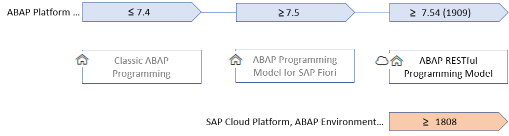

# End to End SAP ERP process

This repository contains the documentation of the scenario used in the lecture
"ERP Systeme implementieren und erweitern" to show an end to end process using
current SAP technologies. The scenario uses the following technologies:

* SAP NetWeaver ABAP
* SAP Programming Model for Fiori including
  * CDS
  * BOPF
  * Fiori Elements
* SAP Cloud Platform including
  * Workflow Service
  * Business Rules Service
  * SAP Web IDE
* SAP CAP for Javascript
* SAP UI5
* SAP API Hub

As stated above the SAP Programming Model for Fiori is used to implement the scenario.
With the [ABAP Restful Programming Model](https://help.sap.com/viewer/923180ddb98240829d935862025004d6/Cloud/en-US/289477a81eec4d4e84c0302fb6835035.html) SAP already provides an evolution of the used programming model.
Nevertheless, the SAP Programming Model for Fiori is the one underlying most of the current S/4HANA
functionality. Furthermore, the SAP Programming Model for Fiori is also available in the recent
SPA Netweaver releases underlying e.g. the recent SAP ERP releases. Therefore, this programming model
is available in a large number of SAP installations and, consequently, used as a basis for this lecture.

The following figure shows the relation of the different programming models.

## Documentation

The documentation describes the necessary steps to implement the overall end to end scenario.
First, the overall scenario as well as the components comprising the scenario are introduced.
After that, a step by step description of how to build the different components is given. However,
the step by step description is not a tutorial describing all necessary steps. Instead only parts of the
components are describe as a tutorial. Other parts are exercises that need to be solved by the students using the
knowledge gained in the previous steps and available documentation.

Nevertheless, a possible solution for each of the exercises is available as part of this repository.

1. [Scenario Overview](docs/overview.md)
1. [Exploring the EPM](docs/exploring_epm.md)
1. Order Monitor
    1. [Introduction to CDS](docs/cds_intro.md)
    1. [The Virtual Data Model of the Sales Order Monitor](docs/order_monitor_vdm.md)
    1. [Exposing the Virtual Data Model with OData](docs/order_monitor_odata.md)
    1. [Fiori Elements based Sales Order Monitor](docs/order_monitor_fe_1.md)
    1. [Extending the Sales Order Monitor using Annotations](docs/order_monitor_fe_2.md)
    1. [Extending the Sales Order BOPF object](docs/order_monitor_bopf.md)
1. Red Qualtrics Killer
    1. [RQK Overview](docs/rqk_overview.md)

## Open Issues

1. Value help for BP, product and status are missing. [Related Documentation](https://help.sap.com/viewer/cc0c305d2fab47bd808adcad3ca7ee9d/1809.000/en-US/38126a6ef7cc4a02b8ffc812b5c11b38.html).
1. Solutions to the exercises.
1. Tags to access the solutions to the different exercises.
1. The whole SCP part is missing.

## Technologies & Frameworks

The following links point to the official documentation as well as useful blogs of the different technologies and tools used to build the end to end scenario.

### ABAP, CDS and BOPF

* [ABAP Keyword Documentation](https://help.sap.com/doc/abapdocu_751_index_htm/7.51/en-US/index.htm)
* [Unit Testing with ABAP Unit](https://help.sap.com/viewer/c238d694b825421f940829321ffa326a/1809.000/en-US/08c60b52cb85444ea3069779274b43db.html)
* [ABAP CDS Development User Guide](https://help.sap.com/viewer/f2e545608079437ab165c105649b89db/7.51.2/en-US/4ed1f2e06e391014adc9fffe4e204223.html)
* [Official BOPF Documentation](https://help.sap.com/viewer/aa7fc5c3c1524844b811735b9373252a/7.51.2/en-US/ff7b806c01e44df7ba70878cc11d8a73.html)
* [ABAP Development Tools (ADT) for Eclipse](https://help.sap.com/viewer/7bfe8cdcfbb040dcb6702dada8c3e2f0/7.51.2/en-US/a3314a7fd9384ce8a40eff2d3b144628.html?q=ABAP%20CDS%20Development%20User%20Guide)

### SAP Programming Model for Fiori related documentation

* [Official Docu of the ABAP Programming Model for Fiori](https://help.sap.com/viewer/cc0c305d2fab47bd808adcad3ca7ee9d/1809.000/en-US/3b77569ca8ee4226bdab4fcebd6f6ea6.html)
* [Introduction to SAP Fiori Elements](https://experience.sap.com/fiori-design-web/smart-templates/)
* [CDS Annotations in Netweaver 7.51 SP2](https://help.sap.com/viewer/cc0c305d2fab47bd808adcad3ca7ee9d/7.51.2/en-US/630ce9b386b84e80bfade96779fbaeec.html)
* [Common tasks when defining UIs based on CDS Annotations](https://help.sap.com/viewer/cc0c305d2fab47bd808adcad3ca7ee9d/7.51.2/en-US/79d27f9b1c8440098acad66173409322.html)
* [Fiori Elements Wiki](https://wiki.scn.sap.com/wiki/display/Fiori/Fiori+elements)

### SAP Cloud Platform

#### Important links

* [SAP Cloud Platform Trial](https://www.sap.com/cmp/td/sap-cloud-platform-trial.html)
* [SAP Cloud Platform Cockpit](https://cockpit.hanatrial.ondemand.com/cockpit/#/home/trial)

#### Documentation 

* [SAP WebIDE Resources](https://developers.sap.com/topics/sap-webide.html#details)

### SAP Cloud Application Programming (CAP) Model documentation

* [Official CAP Docu](https://cap.cloud.sap/docs/)
* [Blog Series on SAP CAP](https://blogs.sap.com/2019/10/19/build-an-english-premier-league-app-with-sap-cloud-application-programming-model-part-1-the-story-begins/)

### SAP UI5 documentation

* [SAP UI5 Docu](https://sapui5.hana.ondemand.com/#/topic)
* [SAP UI5 Walktrough](https://sapui5.hana.ondemand.com/#/topic/3da5f4be63264db99f2e5b04c5e853db)
* [Debugging Fiori and SAP UI5](https://blogs.sap.com/2018/02/14/debugging-fiori-and-ui5-materials/)

## References

The following documents where used as as a basis to create this tutorial.

[1] C. Chiuaru, S. Freilinger-Huber, T. Stark, and T. Trapp, ABAP-Entwicklung für SAP S/4HANA Programmiermodell für SAP Fiori inkl. CDS, BOPF, UI-Entwicklung. Galileo Press, 2019.

[2] O. Graeff, A. Fischer, Build your own SAP Fiori App from back end to user interface. SAP. 2019
