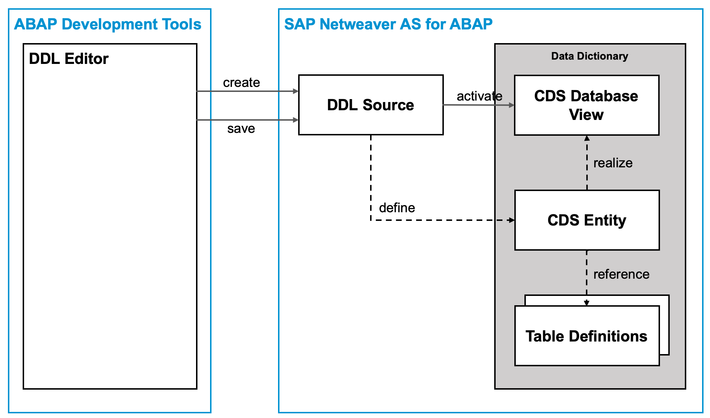
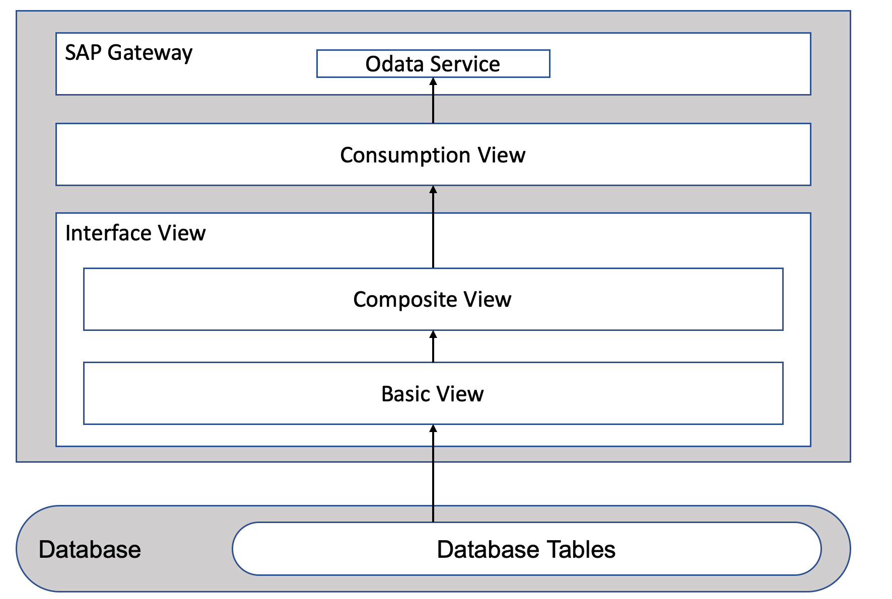
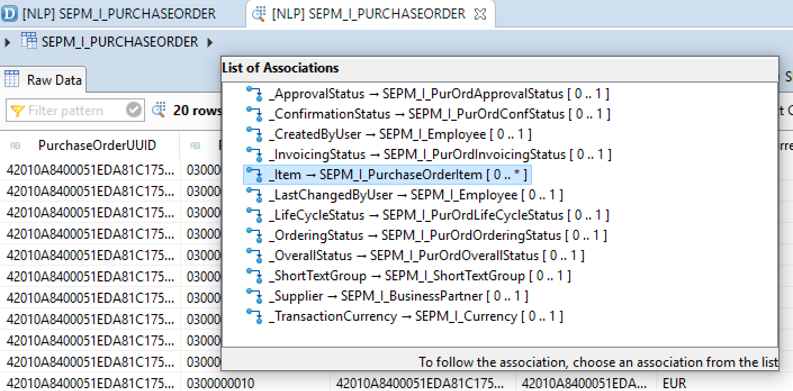

# The Virtual Data Model of the Order Monitor

The virtual data model of the Order Monitor is defined using different Core Data Service (CDS) views.
Before building the virtual data model of the Order Monitor CDS is explored in some more detail.

## Introduction to ABAP CDS

SAP created different variants of Code Data Services (CDS) for different development scenarios. In particular 
there are the ABAP Code Data Service and the Core Data Services of the Cloud Application Programming Model (https://cap.cloud.sap/docs/).
The variants a similar but differ with respect to the supported features. The discussion in this document focuses on the ABAP 
variant of Core Data Service. 

In the ABAP documentation Core Data Service (CDS) is defined as follows
> CDS introduce a common set of domain-specific languages (DSL) and services for defining and consuming semantically rich data models.

What does semantically rich data models mean in this context? Basically, CDS tries to solve two problems:

1. Cryptic names of database tables and database fields
1. Association of database tables and database fields with additional metadata.

In a system like SAP ERP, that has grown over several decades it is often the case that names of database
table and fields are quite cryptic. The naming often uses abbreviations of special terms that are not
easily understandable. Furthermore, the relation of different database tables
to each other is often unclear and not well documented. An example of such cryptic table naming is that table 'BUT000'. 
This table contains the main part of the business partner data in SAP ERP and CRM. Without additional information
it is not clear

- Which data this table contains
- How it is related to the other tables in SAP ERP or CRM

Besides this problem with naming it is often necessary to associate metadata with database tables or fields. The
classic example for this requirement is storing an amount in a certain currency in a database table.
To do this a database field for storing the amount and a database field for storing the currency code is required.
Without CDS it is not possible to store the metadata which field contains the currency code and
to which field this currency code is related.

CDS solves these issues by enabling

- The creating of an abstraction on top of the underlying database tables (i.e. the definition of entities)
- The usage of semantically rich names for the attributes of the entities
- The possibility to model the relation of the entities to each other
- The creation of different layer to support different abstractions for different usage scenarios.

### Virtual Data Models

In SAP S/4HANA CDS is used by SAP to deliver a comprehensive virtual data model. This virtual data model
consists of different CDS entities for different **usage scenarios** and different **domains**. For example, SAP
delivers CDS entities for

- transactional use cases
- analytical use cases
- as a basis for APIs.

Furthermore, SAP defines which CDS entities are **released** to customers and partners to be used in custom applications.
The main goal of this virtual data model is to provide a **stable interface** to the underlying data model. This enables SAP to e.g. change the fields of the underlying database tables in the future without the need for customers to
adjust their custom applications.

In this tutorial CDS is used to create a virtual data model on top of the SAP NetWeaver Enterprise Procurement Model (EPM).

### CDS Architecture

The following figure shows an overview of the CDS architecture. The ABAP Development Tools for Eclipse (ADT) are used 
to create and edit DDL (Data Definition Language) source files in the application server. These DDL files define a
**CDS entity**. Each CDS Entity references one or several database tables or views. Once the DDL is activates the CDS entity
is realized by a **(CDS) database view**.



Note, that this architecture allows the layering of CDS Entities. One CDS Entity can reference other CDS entities.
This is possible as all CDS entities are realizes as views in the database.

### CDS Syntax

The following snippet shoes an extract of the `SEPM_I_PurchaseOrder` entity. This CDS entity is part of the package `S_EPM_CDS_REF`.

```cds
@EndUserText.label: 'EPM Demo: Purchase Order'
@VDM.viewType:#BASIC
...
@AbapCatalog.sqlViewName: 'SEPM_IPO'
@ObjectModel.representativeKey:'PurchaseOrderUUID'
define view SEPM_I_PurchaseOrder
  as select from snwd_po
{
  key node_key         as PurchaseOrderUUID,
      @ObjectModel.readOnly: true
      po_id            as PurchaseOrder,
      note_guid        as ShortTextGroupUUID,
      partner_guid     as SupplierUUID,
      @Semantics.currencyCode: true
      currency_code    as TransactionCurrency,
      @Semantics.amount.currencyCode: 'TransactionCurrency'
      @DefaultAggregation: #SUM
      gross_amount     as GrossAmountInTransacCurrency,
      @Semantics.amount.currencyCode: 'TransactionCurrency'
      @DefaultAggregation: #SUM
      net_amount       as NetAmountInTransactionCurrency,
      ...
}
```

This CDS entity consists of the following parts. An CDS entity with the name `SEPM_I_PurchaseOrder` is defined.
This entity is a selection from the database table `SNWD_PO`. The annotation `@AbapCatalog.sqlViewName` specifies
that the name of the generated database view is `SEPM_IPO`. The element `node_key` of the database table
`SNWD_PO` is marked as the key field for this CDS entity. Furthermore, the field is renamed to `PurchaseOrderUUID`.
Similarly, the field `currency_code` is renamed to `TransactionCurrency`. The annotation `@Semantics.currencyCode``
specifies, that this field contains a currency code.

Additional sematic annotations are added to the field `gross_amount`, which is renamed to `GrossAmountInTransacCurrency`.
This annotation `@Semantics.amount.currencyCode` specifies, that the field containing the required currency code is the field
`TransactionCurrency`. Furthermore, a the annotation `@DefaultAggregation` enables that the value of this fields is aggregated using the sum function in certain scenarios.

### Types of CDS Entities

In the previous example the annotation `@VDM.viewType:#BASIC` was added to the CDS entity `SEPM_I_PurchaseOrder`. This
annotation shows, that the CDS entity is on the lowest level of the virtual data model. The following figure
shows the different type of CDS entities and their layering.



**Interface views** are the most common type of CDS view. They form the basis of the virtual data model and consist of the

- Basic views
- Composite views.

The **basic views** are views which direct access to the database tables. In most of the cases a basic view
is a projection of a single database table and only only contains the names of the fields. One of the important goals
of basic views is, that there should be only one basic view selecting the data of an entity.

In contrast to the basic views the **composite views** do not directly access database tables. Instead they combine the
data of several basic views. Composite views can not only used basic views but also other composite views as a basis.
The main challenge when defining composite views is to find the right balance between reuseability and specialization.

Finally, **consumption views** are the topmost layer of the CDS view hierarchy. Consumption views are the entry points
for applications consuming the data. For example, each OData service is usually based on exactly one consumption view.
The consumption view is used to enhance the business logic of the interface views with presentation specific information.
This is done, for example, by using the @UI.* or @Search.* annotations.

### Associations

Another important concept of CDS are the associations. Associations are similar to joins. Using a
defined key relation the data of two views is related to each other. The main difference between
associations ans joins is, that an association is only evaluated during runtime if the data is really requested.

The following listing show an excerpt of the associations defined for the `SEPM_I_PurchaseOrder` view.

```cds
define view SEPM_I_PurchaseOrder
  as select from snwd_po
  ...
  association [0..1] to SEPM_I_BusinessPartner       as _Supplier            on $projection.SupplierUUID = _Supplier.BusinessPartnerUUID
  association [0..*] to SEPM_I_PurchaseOrderItem     as _Item                on $projection.PurchaseOrderUUID = _Item.PurchaseOrderUUID
  association [0..1] to SEPM_I_PurOrdLifeCycleStatus as _LifeCycleStatus     on $projection.PurchaseOrderLifeCycleStatus = _LifeCycleStatus.PurchaseOrderLifeCycleStatus

...
{
  ...
  _Item,
  _Supplier,
  _LifeCycleStatus
  ...
}
```

A nice feature in the ABAP development tools is, that the data preview allows to navigate these associations.


## Exercise 1

In this exercise the CDS entity `SEPM_I_PurchaseOrder` is used to get familiar with some of the basic CDS concepts.
In order to get started open the `SEPM_I_PurchaseOrder` entity in the ABAP development tools (e.g. by searching
for the entity using `<ctrl> - <shift> - <a>`).

1. Preview the data of the CDS entity using the ADT data preview.
1. Navigate to the generated database view and preview the data. What is the difference.
1. Follow the associations of one purchase order in the ADT data preview.
1. Check the meaning of different CDS syntax elements in the ABAP documentation (e.g. using `<F1>`).

## Naming Conventions

When developing data models using CDS naming of entities and fields is an important part of the process.
The goal is to provide easily understandable names as well as support the structuring of the artifacts.
The following naming conventions have proven to support these goals.

Fields should be named using a terms form the business process domain. The names are written in
upper camel case notation. Examples of possible names are `SalesOrderID` or `GrossAmount`. The data type
of the element should not be part of the name.

CDS views should be named according to the following naming convention.
> `<namespace><CDS view prefix><business object name>[<optional suffix>]`

The names consist of the following parts

- `<namespace>`: The customer or partner namespace
- `<CDS view prefix>`: I for interface, C for consumption view, M for meta data extensions
- `<business object name>`: The name of a business object in the domain.
- `<suffix>`: Optional suffix for special types of views (e.g. VH for value helps, TP for transactional views).

The following table gives a view example of correct names according to the above naming convention.

| Type of CDS view | Annotation | Example |
| ---------------- |------------| ------- |
| Basic Interface View | `@VDM.viewType: #BASIC` | `ZI_PurchaseOrderHeader` |
| Composite Interface View | `@VDM.viewType: #COMPOSITE` | `ZI_PurchaseOrderHeader` |
| Consumption View | `@VDM.viewType: #CONSUMPTION` | `ZC_PurchaseOrderHeader` |
| Transactional Object View | `@VDM.viewType: #TRANSACTIONAL` | `ZI_PurchaseOrderHeaderTP` |
| Meta data extension | `@Metadata.layer: #CORE` | `ZM_PurchaseOrderHeader` |

Additionally, the named of the generated database view needs to be specified. This name is specified using the
`@AbapCatalog.sqlViewName`annotation. The name of a database view is only allowed to consist of 16 characters.
Therefore, abbreviations need to be used to name the database views. Furthermore, the database view cannot have the
same name as the CDV view. As a result the database views should be named according to the following naming convention.
> `<namespace><CDS view prefix><abbreviation of cds view name>[<optional suffix>]`

Examples of correct names according to this naming convention are `ZI_POH` or `ZI_POH_TP`

## Navigation

- Next chapter: [The virtual data model of the Sales Order Monitor](../docs/order_monitor_vdm.md)
- Previous chapter: [Exploring the EPM](../docs/exploring_epm.md)
