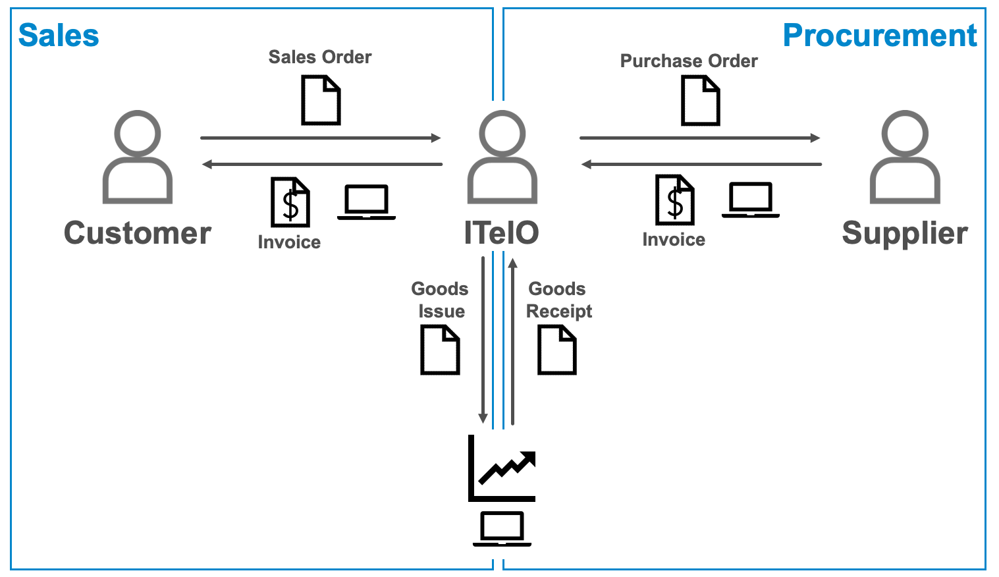

# Exploring the EPM

As mentioned in the [overview](overview.md) this end to end scenario is based on the SAP NetWeaver Enterprise Procurement Model (EPM). An introduction to the EPM is available [here](https://archive.sap.com/documents/docs/DOC-31458).
The aforementioned document state that
> The NetWeaver Enterprise Procurement Model (EPM) is an application intended to be used for
> demonstration and testing purposes. While the scope of EPM is complex enough to be used as basis for
> testing and demonstration of NetWeaver technologies it is not a full-fledged application for a productive
> system environment.

The following figure shows an overview of the business processes available in the EPM. The EPM contains the sales and
procument process as well as the necessary master data and transactional data.

Details of the available master and transactional data can be found in the EPM documentation. In order
to be able to explore the EPM in more detail it is necessary to first generate some sample
data in the EPM. To generate sample data the EPM data generator can be used. It can be accessed
by starting the ABAP transaction **SEPM_DG**.

Using the EPM data generator the sample data for the following business objects can be generated:

- Master data
  - ITelO Employees  
  - ITelO Business Partners
  - Products that ITelO buys and sells
  - Organizational Units of ITelO
  - Employee assignments
  - Product storage locations etc.

- Transactional data
  - Sales orders
  - Purchase orders

## Exercise 1

The goal of the first exercise is to get familiar with the EPM model and the related processes.
To do this either execute the Web Dynpro application **S_EPM_UX_BP** (e.g. in ABAP in Eclipse). Alternatively
the application can be started using the following URL (http://vhcalnplci.dummy.nodomain:8000/sap/bc/webdynpro/sap/s_epm_ux_b). Note, that it might be necessary
to add the IP address of your NetWeaver system to the hosts file in order to beeing able to access the mentioned URL. Using the application try to answer the following questions:

- Which sales orders are related to a given business partner?
- Which products where ordered in this sales order?
- What are the properties of the ordered products?

> If the tutorial is executed on a ABAP Netwever Development System (NPL) is is important that the domain
> vhcalnplci.dummy.nodomain is mapped to the correct IP address in the hosts file. How this is done depends
> on the used operating system. On most *nix based system the hosts file is located in `/etc/hosts`.

## Exercise 2

The exercise consist of two parts:

- Generate sample data for the EPM business objects using the EPM data generator.
- Analyse the database tables in the package `S_NWDEMO_MODEL_DDIC`. Try to answer the following questions:
  - Which tables are related to which business objects?
  - How are the tables related to each other?
  - Try to find all the data related to one of the purchase orders.

## Navigation

- Next chapter: [Introduction to CDS](docs/cds_intro.md)
- Previous chapter: [Exploring the EPM](../docs/exploring_epm.md)
