# Extending the Sales Order BOPF object

In the previous chapters the focus was on implementing the UI of
an application using CDS annotations and the features provided by SAP Fiori Elements.
The BOPF business object generated using the `@ObjectModel` annotation is still in it's
initial state. While it is already possible to, e.g. create new object using the generated
business object, a lot functionality is missing. For example:

- No validation of the entered data against domain values is performed
- No check for mandatory fields is performed
- Administrative data like the creation date and time is not automatically filled.

In this chapter the BOPF business object is extended with this missing functionality.

## Generating and Checking the Semantic Key

The first functionality, that is added to the BOPF object is the automatic creation of the
semantic key and the validation of its uniqueness. In order to automatically create a semantic key a
custom number range object is used. The validation of the uniqueness is performed using standard
functionality of the BOPF object.

### Uniqueness Checking of the Semantic Key

In order to add a uniqueness check to a BOPF field open the respective node of the BOPF object.
In the example below the generated BOPF object is named `ZI_PURCHASEORDERHEADERTP`. The semantic key belongs
to the root node of the BOPF object, named `ZI_PURCHASEORDERHEADERTP` as well. In the root node view of BOPF object
an new alternative key can be created on the tab **Alternative Key** by clicking on **New**.

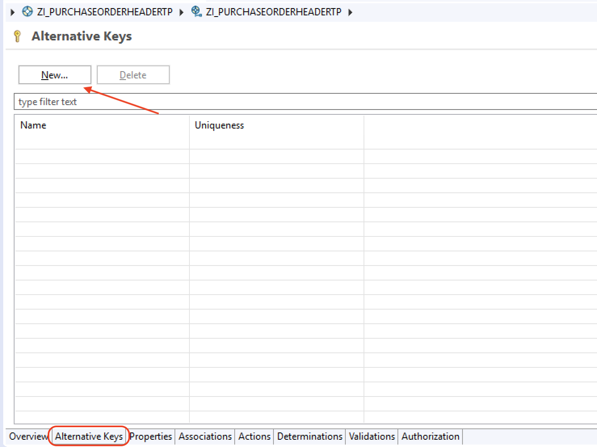

In the example below a new alternative key with the name `UNIQUE_PURCHASEORDERID` is created.

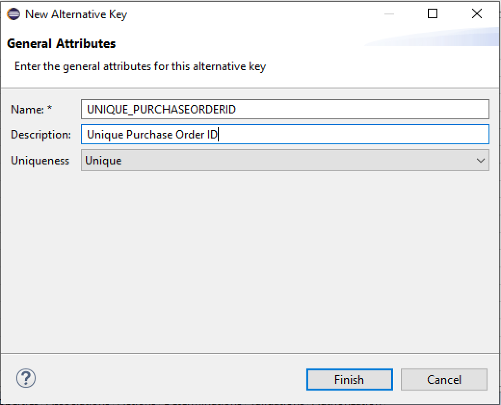

After the new alternative key has been create use the bread crump navigation to get to its details.

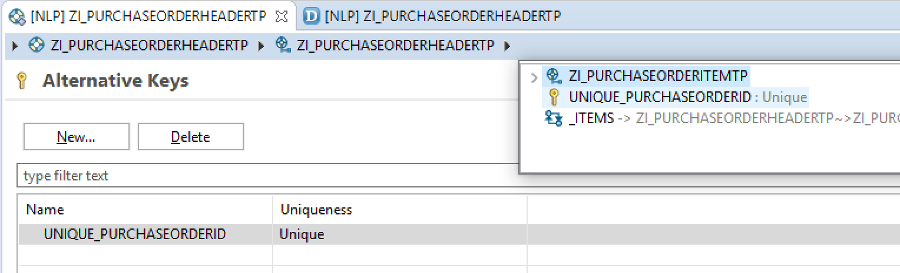

In the details of the alternative key the elements comprising the key can be selected. In the example below
the purchase order id, which is the semantic key of the BOPF object, is used as the only element. After
adding the details the alternative key can be saved and activated. 

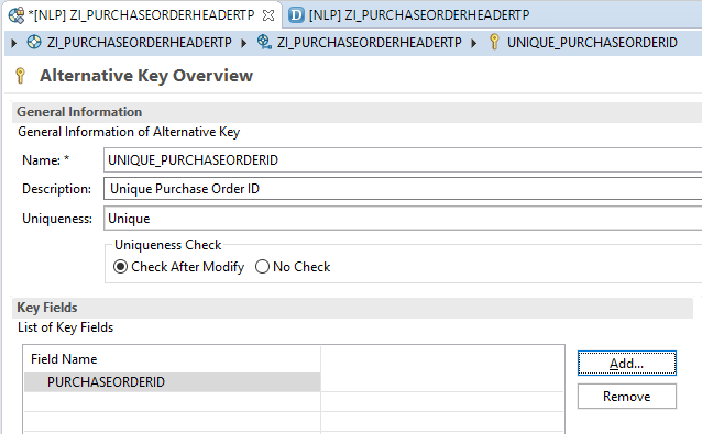

> **Note:** When activating an alternative key automatically a validation named 
> `ALTKEY_UNIQUNESS_CHECK` is created in the
> BOPF object. This validation, however, is not visible in the BOPF editor in Eclipse. to see the generated validation
> the BOPF object has to be opened in transaction **BOBX**

After adding the unique alternative key it is not possible anymore to create two objects with
the same semantic key. If a user tries to create a object with the same key an error message is shown.

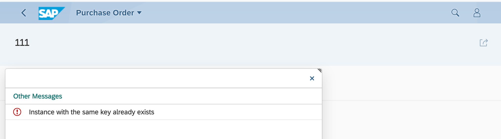

### Exercise 1

Extend the generated BOPF object underlying the Sales Order Monitor with a uniqueness check for the semantic key.
After the uniqueness check is implemented try to create sales orders in the Sales Order Monitor and
use the same semantic key. Which error message is raised?

### Creating Semantic Keys using a Number Range Object

After the validation of the uniqueness of the semantic key is implemented the next step is to automatically create
the semantic key using a number range object. In order to implement this a custom number range is required.
Number range objects are create using the transaction **SNRO**.

The following example shows the creation of a number range object named `Z_PO_NR`. It is a number range object for
purchase order numbers.

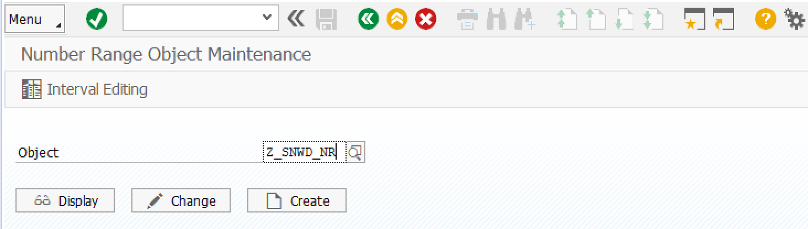

The important parameter is the domain lenght. In this example the domain underlying the purchase order id is used. 

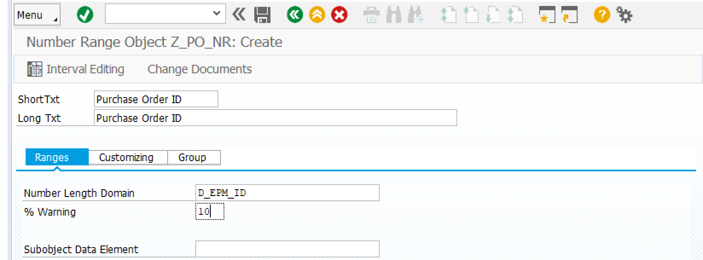

After the number range has been saved an interval needs to be maintained for the number range. In this example the 
interval with the id `01` and a value ranging from `3010000000` to `3019999999`is created. The screenshot
shows that no number has been drawn from this range so far. Its current status is still 0.

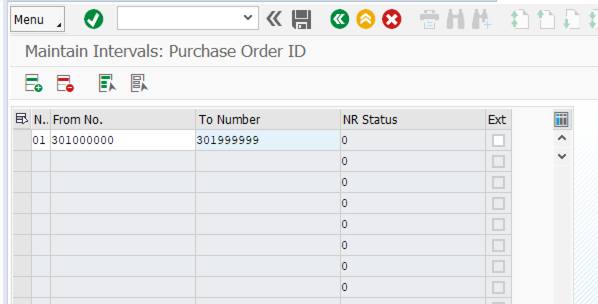

Once the number range has been created a determination needs to be implement for the BOPF object. Determinations
are used to *determine* values of BOPF object fields. To create a determination navigate to the root node of the
BOPF object. On the tab **Determinations** click on **New...**. This creates a new determination for the BOPF object.
In the example the determination is named `GENERATE_PO_ID`. 

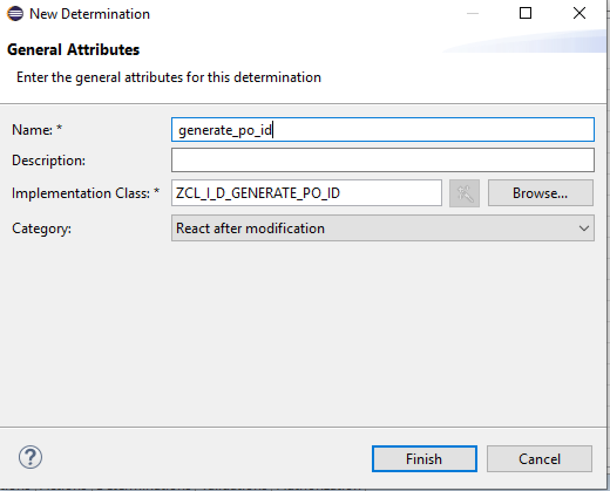

For each determination a corresponding implementation class is generated. In the example the implementation class is `ZCL_I_D_GENERATE_PO_ID`. In the details for the new determination (the bread crump navigation can be used to get there)
it can be specified when a determination is executed. In this case the determination should only be execute when
the object is first created. 

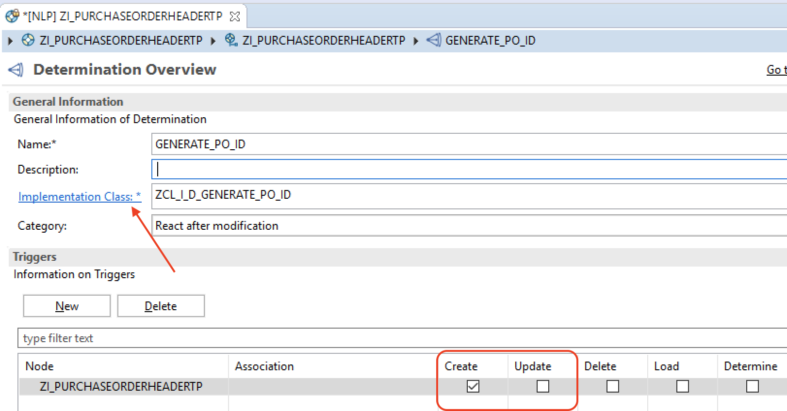

In the execute method of the implementation class the creation of the semantic key using the number range
needs to be implemented. The source code excerpt below shows the code that needs to be implemented in the
`execute` method of the generated class.

> **Note:** The type names like `ztipurchaseorderheadertp1` are generated when the BOPF object is created.
> The code completion feature in Eclipse can be used to find the correct type names when implementing the
> execute method. 

```ABAP
  METHOD /bobf/if_frw_determination~execute.
    DATA purchase_orders TYPE ztipurchaseorderheadertp1.

    io_read->retrieve(
      EXPORTING
        iv_node                 = is_ctx-node_key
        it_key                  = it_key
      IMPORTING
        eo_message              = eo_message
        et_data                 = purchase_orders
        et_failed_key           = et_failed_key ).

    LOOP AT purchase_orders REFERENCE INTO DATA(purchase_order).
      CALL FUNCTION 'NUMBER_GET_NEXT'
        EXPORTING
          nr_range_nr             = '01'
          object                  = 'Z_PO_NR'
        IMPORTING
          number                  = purchase_order->purchaseorderid
        EXCEPTIONS
          interval_not_found      = 1
          number_range_not_intern = 2
          object_not_found        = 3
          quantity_is_0           = 4
          quantity_is_not_1       = 5
          interval_overflow       = 6
          buffer_overflow         = 7
          OTHERS                  = 8.

      io_modify->update(
        EXPORTING
          iv_node          =  is_ctx-node_key
          iv_key           =  purchase_order->key
          is_data          =  purchase_order
         it_changed_fields =
             VALUE #(
                 ( zif_i_purchaseorderheadertp1_c=>sc_node_attribute-zi_purchaseorderheadertp-purchaseorderid )
             )
      ).
    ENDLOOP.
  ENDMETHOD.
```

### Exercise 2

1. Create a custom number range object for the sales order id
1. Extend the BOPF object underlying the Sales Order Monitor with a determination to automatically generate the sales order id from this number range.
1. Test the creation of new sales orders in the Sales Order Monitor again.

> **Question:** Why is it necessary to implement a check for the uniqueness of the semantic key also
> its values are drawn from a number range object?

### Exercise 3

1. Currently, it is still possible to enter the sales order id in the sales order monitor (although the entered id will be ignored). Use the annotation `@ObjectModel.readOnly: true` to disable the manual entry of a sales order id.
2. Extend the BOPF object of the Sales Order Monitor to automatically create item numbers whenever a new item is added to a sales order. The item numbers should start with the number 10 for the first item and should be incremented by 10 for every further item. Furthermore, also ensure that the item numbers a unique.

## Automatic Storing Administrative Data

The next step functionality, that is added to the BOPF object is the automatic storing and updating
of administrative data. This data is:

- which user creates an object and when
- which user performed the last change of an object and when.

This functionality can be added using the following CDS annotations in newer SAP NetWeaver releases:

- `@Semantics.user.createdBy`
- `@Semantics.systemDate.createdAt`
- `@Semantics.user.lastChangedBy`
- `@Semantics.systemDate.lastChangedAt`.

Using these annotation in a CDS view, as shown in the source code excerpt below,  would
result in the automatic creation of a determination for the business
object.

```CDS
...
define view ZI_PurchaseOrderHeaderTP 
    as select from ZI_PurchaseOrderHeader 
    /* associations to other BOPF nodes */
    association [0..*] to ZI_PurchaseOrderItemTP as _Items
        on $projection.PurchaseOrderHeaderKey = _Items.PurchaseOrderHeaderKey
    association [0..1] to snwd_bpa as _Supplier
        on $projection.SupplierKey = _Supplier.node_key
{
    ...
        //@Semantics.user.createdBy: true
        //CreatedBy,
        @Semantics.systemDate.createdAt: true
        CreatedAt,
        //@Semantics.user.lastChangedBy: true
        //ChangedBy,
        @Semantics.systemDate.lastChangedAt: true
        ChangedAt,
    ...
} 
```

However, in the release used for this lecture the functionality is not available yet. Therefore, a determination
updating this date needs to be implemented manually. A very simple implementation of the execute
method to update the created at and change at fields is given in the following source code excerpt.

```ABAP
  METHOD /bobf/if_frw_determination~execute.
    DATA purchase_orders TYPE ztipurchaseorderheadertp1.
    DATA timestamp TYPE timestampl.

    io_read->retrieve(
      EXPORTING
        iv_node                 = is_ctx-node_key
        it_key                  = it_key
      IMPORTING
        eo_message              = eo_message
        et_data                 = purchase_orders
        et_failed_key           = et_failed_key ).

    LOOP AT purchase_orders REFERENCE INTO DATA(purchase_order).
      GET TIME STAMP FIELD timestamp.

      IF purchase_order->createdat IS INITIAL.
        purchase_order->createdat = timestamp.
      ENDIF.

      purchase_order->changedat = timestamp.

      io_modify->update(
        EXPORTING
          iv_node          =  is_ctx-node_key
          iv_key           =  purchase_order->key
          is_data          =  purchase_order
         it_changed_fields =
             VALUE #(
                 ( zif_i_purchaseorderheadertp1_c=>sc_node_attribute-zi_purchaseorderheadertp-createdat )
                 ( zif_i_purchaseorderheadertp1_c=>sc_node_attribute-zi_purchaseorderheadertp-changedat )
             )
      ).
    ENDLOOP.

  ENDMETHOD.
```

### Exercise 4

Extend the BOPF object underlying the Sales Order Monitor with a determination to automatically store the
date when an sales order was created or changed. Make sure the change time is also updated
when a item of the sales order is changes.

## Adding Mandatory Fields

Currently, no mandatory fields have been defined in the BOPF object. In the purchase order example this results
in the possibility to create purchase orders without a supplier or purchase order items without a product.
The definition of mandatory fields can be performed using the `@ObjectModel.mandatory: true` annotation.

The following source code excerpt shows the purchase order consumption view. In this example the
supplier key is set as a mandatory attribute using the annotation.

```CDS
...
define view ZI_PurchaseOrderHeaderTP 
    as select from ZI_PurchaseOrderHeader 
    /* associations to other BOPF nodes */
    association [0..*] to ZI_PurchaseOrderItemTP as _Items
        on $projection.PurchaseOrderHeaderKey = _Items.PurchaseOrderHeaderKey
    association [0..1] to snwd_bpa as _Supplier
        on $projection.SupplierKey = _Supplier.node_key
{
    key PurchaseOrderHeaderKey,
        @ObjectModel.readOnly: true
        PurchaseOrderID,
        
        @ObjectModel.mandatory: true
        SupplierKey,
...
} 
```

After the annotation has been added to the CDS view, a Fiori Elements based application already marks the fields as
mandatory (with a red asterix next to the field). However, the BOPF object does not yet check that the mandatory 
fields are presend. 

An other result of the annotation is, that the properties of the BOPF object are updated 
(cf. teh following screen shot). These properties should **never** be modified manually it the BOPF object is generated from a CDS view! Manual changes will be overwritten when the BOPF object is regenerated.

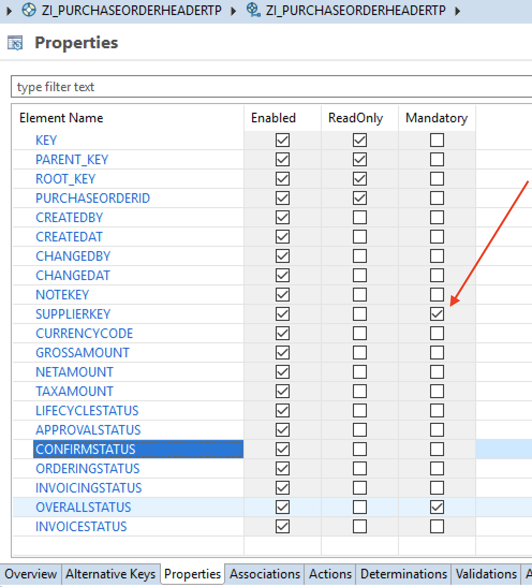

> **Note:** Adding the annotation `@ObjectModel.mandatory: true` to the CDS view does not automatically
> activate the corresponding BOPF object. The BOPF object needs to be **manually activated** afterwards.

In order to check that values are provided for the the mandatory field a validation needs to be added to the BOPF object. Fortunately, the class `/BOBF/CL_LIB_V_MANDATORY_ATTR`can be used to quickly implement the validation.
The following screenshot shows how the validation can be implement using the provided class.

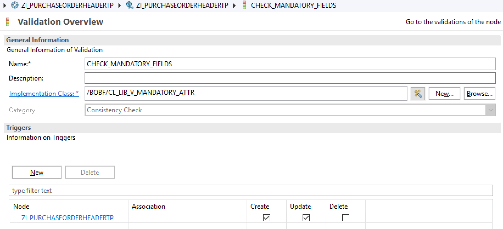

Once the new validation is active, it is not possible anymore to create an object without providing
the mandatory fields.  

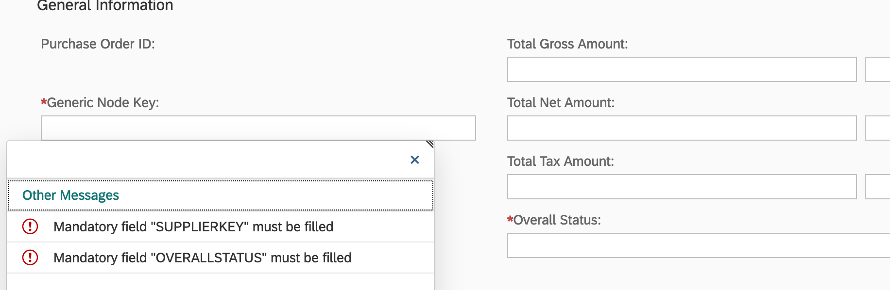

### Exercise 5

Extend the  Sales Order Monitor with a check for mandatory fields. The following fields should be mandatory:

- Supplier Key
- Overall Status
- Product Key.

Make sure the checking of the mandatory fields works.

## Adding Actions

The final feature that is added are actions. Actions can be used to perform changes of a BOPF object.
As an example an action is implemented that allows to set the overall status of an order to completed.

In order to add an action click on **New...** on the **Actions** tab of the BOPF object. In the example
the `SET_OVERALL_STATUS_COMPLETED` action is shown. This action can be performed on a single instances of
the BOPF object (cf. Instance Multiplicity). Furthermore, the exporting type of the action is ste to `Node` and
the business object and the node name are provided.

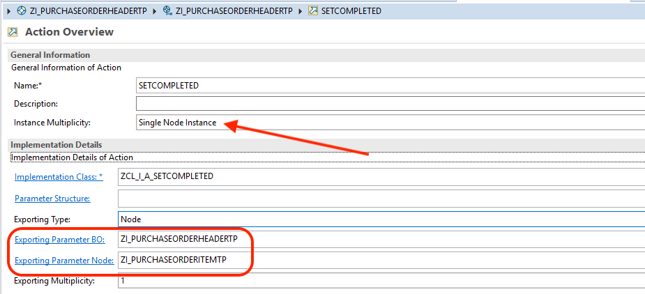

The following source code except shows a basic implementation of this action. Without any checks the overall
status is simply set to completed.

```ABAP
  METHOD /bobf/if_frw_action~execute.
    DATA(purchase_orders) = VALUE ztipurchaseorderheadertp1(  ).

    io_read->retrieve(
      EXPORTING
        iv_node                 = is_ctx-node_key
        it_key                  = it_key
      IMPORTING
        et_data                 = purchase_orders ).

    LOOP AT purchase_orders REFERENCE INTO DATA(purchase_order).
        purchase_order->overallstatus = |C|.

        io_modify->update(
          EXPORTING
            iv_node           = is_ctx-node_key
            iv_key            = purchase_order->key
            iv_root_key       = purchase_order->root_key
            is_data           = purchase_order
            it_changed_fields = value #(
                                   ( zif_i_purchaseorderheadertp1_c=>sc_node_attribute-zi_purchaseorderheadertp-overallstatus )
                                    )
        ).

    ENDLOOP.

  ENDMETHOD.
```

Once the action is implemented it can already be tested in the BOPF test environment.

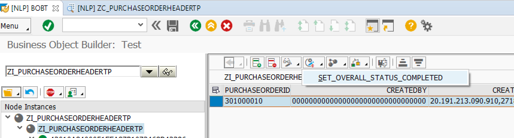

The next step is to also add the action to the UI. This can be done using CDS annotations
as shown in the following source code excerpt.

```CDS
...
annotate view ZC_PurchaseOrderHeaderTP with
{
  ....
  @UI.lineItem:[{
    position: 10
  },
  {
    type: #FOR_ACTION,
    label: 'Set Status Completed',
    dataAction: 'BOPF:SET_OVERALL_STATUS_COMPLETED'
  }]
  @UI.identification:[{position: 10}]
  @UI.selectionField:[{position: 10}]
  PurchaseOrderID;
  ...
}
```

> **Note:** If the OData service for this business object has been created using the reference data source approach it is necessary to 
> **regenerate** teh project. Only then will the new action be exposed by the OData service.

Finally, the action can now be used in the UI.

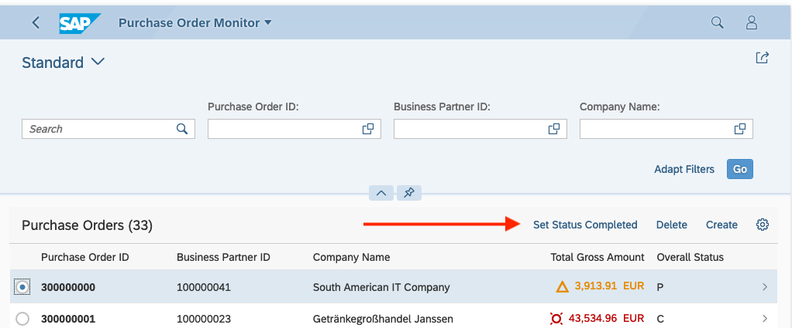

### Exercise 5

Extend the  Sales Order Monitor with two actions:

1. On the item level add an action to set the status of an item to paid.
1. On the head level add an action to ste teh order to completed. This should only be possible if all the items of the order have been paid.

Make sure actions work as expected.

## Navigation

- Next chapter: [RQK Overview](../docs/rqk_overview.md)
- Previous chapter: [Extending the Sales Order Monitor using Annotations](../docs/order_monitor_fe_2.md)