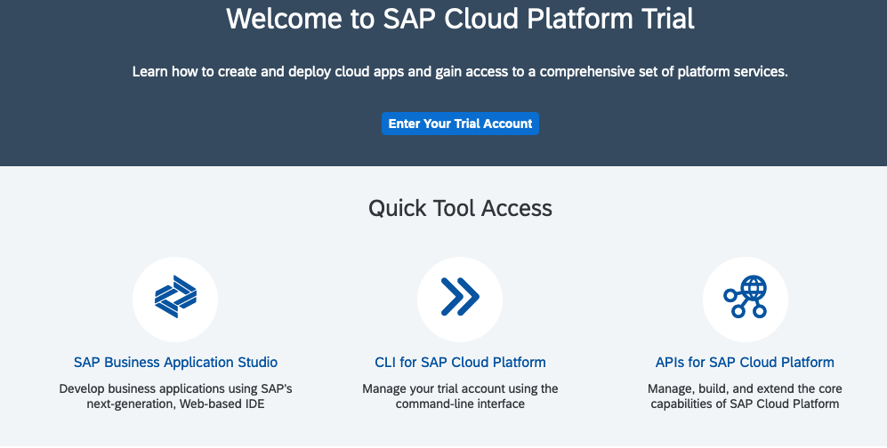
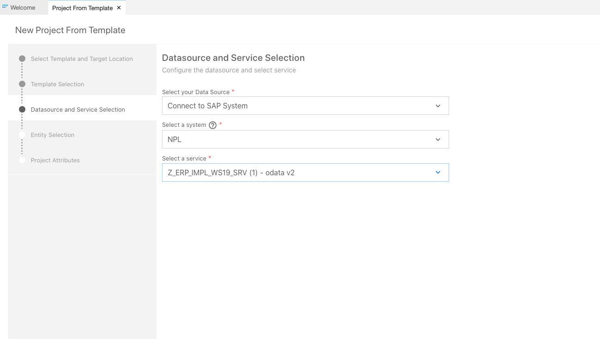
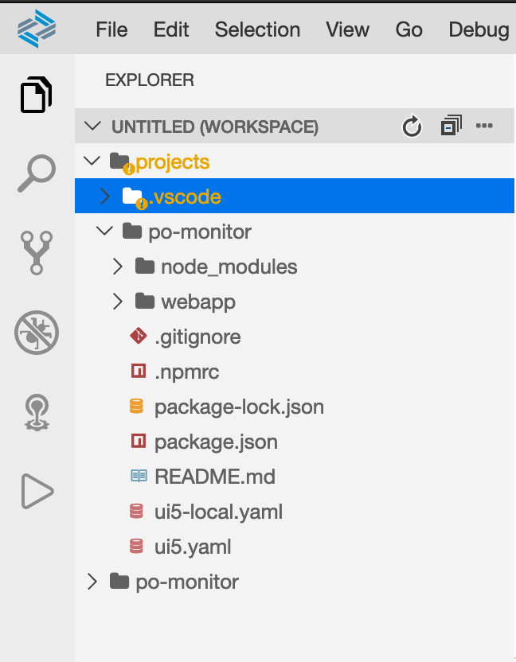

# Fiori Elements based Sales Order Monitor

After the virtual data model has been exposed as an OData service, the next step is to create
the Fiori Elements application based on this OData service.

## Prerequisites

This chapter requires two things:

- a SAP Cloud Platform trial account
- a connection between the SAP Cloud Platform and the SAP NetWeaver AS ABAP.

### SAP Cloud Platform Trial Account

SAP offers a free trial of the SAP Cloud Platform. You can register for this trial
[here](https://www.sap.com/cmp/td/sap-cloud-platform-trial.html).
There is a [tutorial](https://developers.sap.com/tutorials/hcp-create-trial-account.html)
available showing that shows the necessary steps to register
for the trail account. Furthermore, the
[tutorial](https://developers.sap.com/tutorials/hcp-create-trial-account.html) also  
shows how to navigate the trail account and where to find certain information.

Note, that teh SAP Cloud Platform trail account has certain limitations. These limitations are described
[here](https://help.sap.com/viewer/3504ec5ef16548778610c7e89cc0eac3/LATEST/en-US/046f127f2a614438b616ccfc575fdb16.html).
Especially the section trial life cycle is important. It describes after which time a trial
account is deleted (including all its content). Therefore, you should store all your important content somewhere
else, e.g. in a Github repository.

### Connecting the SAP Cloud Platform to the SAP NetWeaver AS ABAP

In order to create a connection between the SAP Cloud Platform and the SAP NetWeaver AS ABAP a destination needs
to be created in the SAP Cloud Platform cockpit. To create a destination navigate to the trial sub account and open
**Connectivity -> Destinations**.


In this view click on **New Destination**. Enter the following data for the destination:

- Name: The name for this destination, e.g. NPL
- Type: HTTP
- Description: A free text description of the destination
- URL: the IP address of the SAP NetWeaver AS ABAP including the HTTP port (http://<ip-address>:8000)
- Proxy Type: Internet
- Authentication: Basic Authentication
- Username: The username of the SAP NetWeaver AS ABAP. If this is the developer trial of SAP Netweaver the username is DEVELOPER
- Password: The password of the user.

Furthermore, the following properties need to be added to the destination. Note, not all properties are available in the
dropdown list. If a property is missing simply enter the property manually.

|Property      | Value       |
|--------------|-------------|
|WebIDEEnabled | true |
|WebIDESystem  | The system ID of the SAP NetWeaver AS ABAP. This is NPL for the SAP NetWeaver developer trial. |
|WebIDEUsage   | odata_abap |
|sap-platform  | ABAP |
|sap-client    | The client number of the SAP NetWeaver AS ABAP. This is 001 the SAP NetWeaver developer trial. |
|HTML5.DynamicDestination | true|

Click finish to create the destination.


## Create the Sales Order Monitor

The next step is to create the first version of the Sales Order Monitor. The Sales Order Monitor
is based on the SAP Fiori Elements. To create Fiori Elements based applications the SAP Business
Application Studio offers a range
of templates. In this chapter a first version of the Sales Order Monitor is generated based on
one of these templates. After this, annotations in the CDS views are used do adjust the appearance and behavior
of the generated application.



### Accessing the SAP Business Application Studio

In order to access the SAP Business Application Studio open the SAP Cloud Platform cockpit of your trial account.
On the main page you find a link to the Business Application Studio. Click on this link to navigate to the SAP
Business Application Studio main page.

First, you need to create a Dev Space to use. To create a new Dev Space before click on **Create Dev Space**. On
the next screen provide a name for the dev space and select **SAP Fiori** the the application kind.
By selecting SAP Fiori the necessary extension to create SAP Fiori Elements applications are pre-installed into
the new Dev Space.


Click on **Create Dev Space** to finish the creation of the Dev Space. The creation of the Dev Space takes a few
minutes. Once the creation is finished the status of the Dev Space changes to **running**. Now the Dev Space can be accessed by clicking on its name.


Note, that the Dev Spaces are shut down if they ar not in use. Therefore, it might be necessary to
restart an existing Dev Space using the play button before being able to access it.

### Creating an App using a Template

The first step is to create an initial version of the Sales Order Monitor using one
of the template offered by the SAP Business Application Studio. To select a template
open the SAP Business Application Studio and
click on **Create project from template** on the Welcome page. This opens a wizard that guides
the user through the creation of the app.


On the first screen of the wizard specify where to create the project. For now the default value is fine.
Select the **SAP Fiori elements application** template and click on **next**.
On the following screen select **List Report Object Page** as the application type and click on **next**.
On the screen **Basic Information** of the wizard the project name and the name of the created application needs to be provided.
In the example an application named Purchase Order Monitor is created.


On the screen **Datasource and Service Selection** screen the OData service,
which is used as a basis for the application, can be selected. The selection of
the OData service consists of three steps:

1. Select the source of the service (e.g. Connect to SAP System)
1. If Connect to SAP System is selected as a source, the source system needs to be selected as well.
In the example the source system is the destination created in one of the previous steps.
1. Once the destination has been selected, all the services available at this destination are listed.
In the example the OData service created using RDS exposure is chosen.



The **Entity Selection** screen allows to adjust the template to the requirements and service at hand.
In the case of the List Report Application the OData collection, that will be the entry to the application,
as well as the navigation entity needs to be chosen.
In the example the `PurchaseOrderHeaders` are used as the OData collection and `toItems` as the OData navigation.


On the **Projects Attributes** screen the main properties of the application can be configured. This
includes the module name, the title and the description of the application.


Finally, clicking on finish generates the application.

### Running the App in the Fiori Launchpad Sandbox

Once the wizard is finished, the generated application, in the example the Purchase Order Monitor
can already be tested. It is not fit for production yet. Nevertheless,
testing in the current state shows, what functionality is already available in Fiori Elements.

The following screenshot shows the generated project in the SAP Business Application Studio.



The generated application can be run using different approaches:

1. By executing `npm run start` in the terminal
1. By right clicking on start in the **NPM Scripts** section and selecting **Run**
1. By executing one of the generated run configurations


Using either of these options results in a pop up with one button **Open in new tab**. Clicking this button
opens a new browser tab showing a folder structure similar to the one in the following image.


Opening the **flpSandbox.html** file in the test folder starts an sandbox version of the
Fiori launchpad including the Fiori Elements application that was just created.


The Purchase Order Monitor is started by selecting the corresponding tile in the Fiori launchpad.
When the Purchase Order Monitor starts not much is to see. There are
a few navigation links but no content. However, it is already possible to click on the **Go** button. This invokes the underlying
OData service. As a result the lower part of the screen changes. However, there is still not much to see.


The reason is, that so far no UI annotations have been provided. So the Fiori Elements template has no information which
data from the OData service should be shown on the screen and how. However, it is possible to partially configure
this in the running application through the build in personalization features.

Clicking on the **Settings** icon open the configuration dialog shown in the following screenshot.


Selecting, for example, the purchase order ID, the total amount and the overall status results in the following layout. It is obvious, that
the sales order data from the EPM is displayed in the Sales Order Monitor.

Furthermore, the total gross amount of the sales order is already displayed with the right currency code next to it. This is due to the
`@Semantics.amount.currencyCode` annotation on the level of the basic interface view (c.f. chapter [The Virtual Data Model of the Sales Order Monitor](../docs/order_monitor_vdm.md)).


### Exercise 1

Create a Sales Order Monitor using the Fiori Elements List Report template. The Sales Order Monitor should use the OData service created in the previous chapter to read
data from the backend.
Once the application is created execute it and try the available personalization and navigation features.

## Configure the App using UI Annotations

The application generated using the LisT Report template is merely a stub. While it is already possible to query backend data several features are still missing.
For example

- Search parameters cannot be specified
- The search result list does not contain any default fields
- The detail view is empty.

In the following section these limitations are solved step by step using different CDS annotations. In particular [@UI annotations](https://help.sap.com/viewer/cc0c305d2fab47bd808adcad3ca7ee9d/7.51.2/en-US/f8af07bb0770414bb38a25cae29a12e9.html)
are used to add additional functionality to the application´.  

### Configuring the Search Result

The first step is to provide some default filed in the search result lists. Additionally, the details page should
at least contains the information visible in the search results. This can be achieved the
`@UI.lineItem` and the `@UI.identification` annotations. In the documentation these two are described as follows:

| Annotation           | Description | Further Information |
|----------------------|-------------|---------------------|
| `@UI.lineItem`       | Annotations belonging to UI.lineItem represent an ordered collection of data fields that is used to represent data from multiple data instances in a table or a list. | [Annotations for Tables and Lists](https://help.sap.com/viewer/cc0c305d2fab47bd808adcad3ca7ee9d/7.51.2/en-US/df2525ef4ca548cf873ff14e00e4372d.html) |
| `@UI.identification` | Annotation belonging to UI.identification represent an ordered collection of specific data fields that together with headerInfo identifies an entity to an end user. | [Annotations for Detail Pages](https://help.sap.com/viewer/cc0c305d2fab47bd808adcad3ca7ee9d/7.51.2/en-US/d59d41808b7545b296823e68ba470c1c.html)|

In order to add fields to the result list or the details page it is sufficient to use the `@UI.lineItem.position` or
`@UI.identification.position` annotation respectively. The following code excerpt shows how these annotations are used to
add different field to the Purchase Order Monitor. Furthermore, the `@UI.hidden` annotations is used to hide certain field from the
filed list available for the personalization of the view.

```ABAP
@AbapCatalog.sqlViewName: 'ZC_POH'
@AbapCatalog.compiler.compareFilter: true
@AbapCatalog.preserveKey: true
@AccessControl.authorizationCheck: #NOT_REQUIRED
@EndUserText.label: 'EPM: Purchase Order Header (transactional)'

/* Definition of the VDM view type */
@VDM.viewType: #CONSUMPTION

/* BOPF object model */
@ObjectModel: {
    modelCategory: #BUSINESS_OBJECT,
    compositionRoot: true,

    /* forwarding of the transactional processing */
    transactionalProcessingDelegated: true,

    semanticKey: ['PurchaseOrderID'],

    createEnabled: true,
    updateEnabled: true,
    deleteEnabled: true
}

define view ZC_PurchaseOrderHeaderTP 
    as select from ZI_PurchaseOrderHeaderTP
    /* associations to other BOPF nodes */
    association [0..*] to ZC_PurchaseOrderItemTP as _Items
    on $projection.PurchaseOrderHeaderKey = _Items.PurchaseOrderHeaderKey 
{
        @UI.hidden: true
    key PurchaseOrderHeaderKey,

        @UI.lineItem.position: 10
        @UI.identification.position: 10
        PurchaseOrderID,

        @UI.hidden: true
        SupplyerKey,

        @UI.hidden: true
        NoteKey,
        CurrencyCode,

        @UI.lineItem.position: 20
        @UI.identification.position: 20
        GrossAmount,
        NetAmount,
        TayAmount,
        LifeCycleStatus,
        ApprovalStatus,
        ConfirmStatus,
        OrderingStatus,
        InvoiceStatus,

        @UI.lineItem.position: 30
        @UI.identification.position: 30
        OverallStatus,

    /* Definition of composition relation */
    @ObjectModel.association.type: #TO_COMPOSITION_CHILD
    _Items
}
```

The following screenshots show the resulting application.


### Exercise 2

Extend the CDS views of the Sales Order Monitor with UI annotations. The result should be that

1. The relevant data elements of the Sales Order Header are shown in the search results.
2. If a Sales Order is selected at least those data fields are also visible in the details view.
3. The relevant data fields of the Sales Order Items are visible in the list as well as the details view.

### Adding Search Capabilities

The next step is to add default search capabilities. The List Report template offers two features that can
be used to provide search capabilities:

- The annotation `@Search.defaultSearchElement` can be used to specify which element are to be considered in a freestyle search.
- The annotations belonging to `@UI.selectionField` allow to provide filtering on a list of data.

The following code excerpt shows an example how these annotations can be used.

```ABAP
...
@Search.searchable: true

define view ZC_PurchaseOrderHeaderTP
    as select from ZI_PurchaseOrderHeaderTP
    /* associations to other BOPF nodes */
    association [0..*] to ZC_PurchaseOrderItemTP as _Items
        on $projection.PurchaseOrderHeaderKey = _Items.PurchaseOrderHeaderKey
    ...
{
        @UI.hidden: true
    key PurchaseOrderHeaderKey,

        @UI.lineItem.position: 10
        @UI.identification.position: 10

        @UI.selectionField.position: 10
        @Search.defaultSearchElement: true
        PurchaseOrderID,

        @UI.hidden: true
        SupplierKey,

        @ObjectModel.readOnly: true
        _Supplier.bp_id as SupplierID,

        @ObjectModel.readOnly: true

        @UI.selectionField.position: 20
        @UI.lineItem.position: 20

        @UI.identification.position: 20
        @Search.defaultSearchElement: true
        _Supplier.company_name as SupplierName,
...
}
```

The resulting Purchase Order Monitor is shown in the following screenshots.


### Exercise 3

Extend the CDS views of the Sales Order Monitor in order to provide search capabilities. The result should be that

1. The freestyle search should consider the sales order ID and the buyer name.
2. There should be selection fields to allow selecting a sales order by sales order IF, buyer name and status.

It is obvious that in order to allow searching for teh buyer name the underlying CDS views need to be extended as well. Perform the following extensions of the CDS views:

1. Add the supplier ID and supplier name to the transactional as well as to the consumption CDS view of the sales oder header.
2. Add the product ID and the product category to the transactional as well as to the consumption CDS view of the sales oder item.

Finally, also add the product ID to the item list and the item details of the Sales Order Monitor.

### Exercise 4

Once the search capabilities are implemented analyse how the different search functionalities are implemented on the
client side. To do this use the developer tools of the browser. Perform the following *manual* searches using just
the URL an a Web browser:

- Freestyle search for a search term
- Search for specific sales order ID.

### Exercise 5

Try to identify the annotations that allow to specify the name for the search results and details page as
shown in the following screenshots of the Purchase Order Monitor. Add names for the search results and
details page to the Sales Order Monitor as well.


## Extracting Metadata into Extension Files

The current approach of mixing different types of annotations in the consumption CDS view
has several disadvantages.

1. The CDS views become cluttered with annotations and consequently very hard to understand.
1. In the consumption CDS view different concerns are mixed together. The current version of the CDS view
underlying the Sales Order Monitor contains, for example annotations related to
    - The layout of the UI
    - Search functionality
    - The object model
    - Transactional behavior.

One solution to this problems is the usage of [**Metadata Extensions**](https://help.sap.com/viewer/cc0c305d2fab47bd808adcad3ca7ee9d/7.51.2/en-US/a3ff1dc494a242ef98d1e22670e1546a.html?q=metadata%20extensions). 
Metadata extensions where initially introduced to allow costumer specific extensions of SAP delivers CDS views
without the need for modifications. Nevertheless, they can also be used to extract UI related
annotations in a separate file.

A metadata extension is created using the menu **Source Code -> Extract Metadata Extension**.


First a name and a description for the metadata extension needs to be provided.


Next, the metatdata to extract into a separate file can be selected.


Clicking on finish results in the creation of the metadata extensions. Initially, there is an error message
that the underlying CDS view cant be extended. This cane be solved using the provided quick fix (`<ctrl> + 1`).


An enhanced CDS can be recognized by a little spiral next to the CDS view definition.


The following code excerpt shows the metadata extension for the Purchase Order Header consumption view.
It is obvious, that the metadata extension only contains the annotations related to the UI.

```CDS
@Metadata.layer: #CORE
@UI.headerInfo.typeName: 'Purchase Order'
@UI.headerInfo.typeNamePlural: 'Purchase Orders'
annotate view ZC_PurchaseOrderHeaderTP with
{
  @UI.hidden: true
  PurchaseOrderHeaderKey;
  @UI.lineItem:[{position: 10}]
  @UI.identification:[{position: 10}]
  @UI.selectionField:[{position: 10}]
  PurchaseOrderID;
  @UI.hidden: true
  SupplierKey;
  @UI.selectionField:[{position: 20}]
  @UI.lineItem:[{position: 20}]
  @UI.identification:[{position: 20}]
  SupplierName;
  @UI.hidden: true
  NoteKey;
  @UI.lineItem:[{position: 30}]
  @UI.identification:[{position: 30}]
  GrossAmount;
  @UI.identification:[{position: 40}]
  NetAmount;
  @UI.identification:[{position: 50}]
  TaxAmount;
  @UI.lineItem:[{position: 40}]
  @UI.identification:[{position: 60}]
  OverallStatus;
}
```

After UI related annotations have been extracted, the consumption view becomes a lot cleaner.
The following excerpt shows the consumption view for the purchase order header after the metadata
has been extracted.

```CDS
@Metadata.allowExtensions: true
define view ZC_PurchaseOrderHeaderTP 
    as select from ZI_PurchaseOrderHeaderTP
    /* associations to other BOPF nodes */
    association [0..*] to ZC_PurchaseOrderItemTP as _Items
        on $projection.PurchaseOrderHeaderKey = _Items.PurchaseOrderHeaderKey 
    association [0..1] to snwd_bpa as _Supplier
        on $projection.SupplierKey = _Supplier.node_key
{

    key PurchaseOrderHeaderKey,

        @Search.defaultSearchElement: true
        PurchaseOrderID,

        SupplierKey,

        @ObjectModel.readOnly: true
        _Supplier.bp_id as SupplierID,

        @ObjectModel.readOnly: true
        @Search.defaultSearchElement: true
        _Supplier.company_name as SupplierName,
        NoteKey,
        CurrencyCode,
        GrossAmount,
        NetAmount,
        TaxAmount,
        LifeCycleStatus,
        ApprovalStatus,
        ConfirmStatus,
        OrderingStatus,
        InvoiceStatus,
        OverallStatus,

    /* Definition of composition relation */
    @ObjectModel.association.type: #TO_COMPOSITION_CHILD
    _Items,

    _Supplier
}
```

### Exercise 6

Extract the UI related annotations of the sales order header and sales oder item consumption view
into separate metadata extensions. Afterwards test the application to make sure it still works as before.

## Layering of Metadata Extension Files

Besides the extraction of UI related meta data from the CDS view, meta data extension also support layering.
Using the `@Metadata.layer` annotation a meta data extension file can be assigned to one of the following layers:

- `#CORE`
- `#LOCALIZATION`
- `#INDUSTRY`
- `#PARTNER`
- `#CUSTOMER`.

## Optional: Deploying the App to the SAP Cloud Platform

So far the Sales Order Monitor has always been executed in the Fiori Launchpad Sandbox.
The next step is to actually deploy the Sales Order Monitor to the SAP Cloud platform.
The SAP Business Application Studio supports the deployment by already providing the
necessary scripts. The deployment to the SAP Cloud Platform consists of the
following steps:

1. Create the required deployment artifacts
1. Build the mtar file
1. Deploy the mtar file to the SAP Cloud Platform

In order to keep the workspace in the SAP Business Application Studio organized it is useful
to first create a separate for to store all the necessary artifacts. While this can be done using
the SAP Business Application Studio UI the approach using the terminal is used in this tutorial.
Open a terminal in the projects folder of the SAP Business Application studio (using a right click
and select "Open in Terminal"). Next execute the following commands to create a new folder and move
the existing application to the newly created folder. Note, that in the example the application
was located in a folder named ```po-monitor``` and moved to a folder ```po-monitor-cf```.

```Shell
mkdir po-monitor-cf
mv po-monitor po-monitor-cf
```

The following figure shows the workspace after moving the project folder. 


After this preparation the next step is to create the required deployment artifacts. To do this
either run the "deploy" task in the NPM Scripts section of the SAP Business Application Studio or
by executing ```npm run deploy``` in a terminal.

Once the script runs a few questions need to be answered in order for the script ot generate
the correct artifacts. Answer the questions als follows:

1. Target is Cloud Foundry as the app will be deployed to the SAP Cloud Platform Cloud Foundry
environment. Use the arrow keys to select it and press enter.
1. The artifacts should be generated in the root folder. The root folder should now point to
the folder created earlier.
1. Enter an ID for the Multi Target Application (MTA). The example uses ```PO-Monitor```.
1. Enter a description for the application.
1. Confirm the proposed version number.
1. Confirm the proposed destination name.
1. Choose to add a Fiori Launchpad (FPL) config
    1. Enter a semantic object. In the example this is the PurchaseOrder.
    1. Enter Display as action.
    1. Enter a title for the app in the Fiori Launchpad.

As the result of the script a number of artifacts are generated in the root folder. Most notably,
a folder named ```cf``` is created. It contains the Fiori Launchpad configuration and the application
router. Furthermore, a ```package.json``` file and a ```mta.yaml``` file ar created.

Right now, these artifacts won't be analysed in detail. They contain the necessary build block to
run the Fiori Elements application in the SAP Cloud Platform Cloud Foundry environment.

In order to build the deployable mtar file execute the build script inside the new ```package.json```
file (either using the NPM Scrips view or by executing ```npm run build``` in a terminal). The result of
executing the script is a deployable ```archive.mtar``` file inside the ```mta_archives``` folder.

The ```archive.mtar``` can be deployed to the SAP Cloud Platform. However, it is necessary to first log in
to the Cloud Foundry environment. This can be done by either clicking on the Cloud Foundry area in the
bottom bar of the SAP Business Application Studio (cf. following screenshot) or by executing ```cf login````
in a terminal.


Once the login is successful the targeted organization and space should be displayed in the
bottom bar of the SAP Business Application studio.

In order to deploy the application execute the deploy script (by right clicking on the
```archive.mtar``` file and selecting "Deploy MTA File" or by executing
```npm run deploy``` in a terminal).

If everything is successful the terminal contains the URL of the application router. This URL can be used
to invoke the deployed app.


Note, that accessing the application requires an authentication in the
SAP Cloud Platform. The script generated all the necessary artifacts to integrate the application with
the SAP Cloud Platform identity provider. Details on the authentication and authorization in the
context of Cloud Foundry and the SAP Cloud platform can be found in this
[blog series](https://blogs.sap.com/2020/09/01/securing-applications-in-a-multicloud-environment/)

## Navigation

- Next chapter: [Extending the Sales Order Monitor using Annotations](../docs/order_monitor_fe_2.md)
- Previous chapter: [Exposing the Virtual Data Model with OData](../docs/order_monitor_odata.md)
