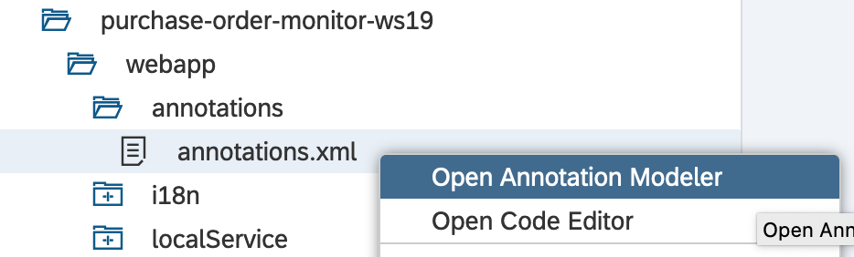

# Extending the Sales Order Monitor using Annotations

In the previous chapter a first version of the Sales Order Monitor was implemented.
In this chapter additional CDS annotations are used to further extend the Sales Order Monitor.
The following features are added to the sales order monitor in the following sections:

- Header information on the object page
- Semantic coloring for a field
- Facets of the object page.

## Header Information on the Object Page

The next step is to fill the empty space in the header area of the object page (cf. following
screen shot) with some information.


The information in this area can be defined using additional annotations in the `@UI.headerInfo` group.
The following source code excerpt shows again the meta data extension of the purchase order header consumption
view. `@UI.headerInfo.title` is used to define the title and `@UI.headerInfo.description` of the object page.
In both cases the value attribute references an element of the underlying CDS view. During runtime, the value of
this element is shown next to the label.

```CDS
@UI.headerInfo : { 
  typeName: 'Purchase Order',
  typeNamePlural: 'Purchase Orders',
  title: {
    label: 'Purchase Order',
    value: 'PurchaseOrderID'
  },
  description: {
    label: 'Supplier',
    value: 'SupplierName'
  }
}
annotate view ZC_PurchaseOrderHeaderTP with
{
  @UI.hidden: true
  PurchaseOrderHeaderKey;
...
}
```

The following screen shot shows the result of the newly added annotations.


### Exercise 2

Extend the Sales Order Monitor with an appropriate title and description in the header of the object page.

## Add Semantic Coloring for a Field

The next step is to add some semantic coloring to on field, both in the list output and the object page.
This can be achieved using the `@UI.lineItem.criticality` and `@UI.identification.criticality` annotation respectively. Detailed information on the criticality annotation can be found [here](https://help.sap.com/viewer/cc0c305d2fab47bd808adcad3ca7ee9d/7.51.2/en-US/81e2259d82f44ce9b5f4ad6377edbd67.html).
The semantic coloring of a field is based on the value of the field specified using
the criticality annotation. The following values are possible:

| Value | Description | Visualization |
|-------| ----------- |---------------|
| 1     | Negative    | Red           |
| 2     |Critical     | Yellow |
| 3     |Positive     | Green |

### Question

How can an attribute be added to a CDS view, that provides the required values?

### Adding the UI Annotations

The following code excerpt shows how the criticality annotation can be used to add semantic coloring
to the gross amount field. In this case the semantic coloring is based on a field named `GrossAmountCriticality`.
This field needs to be present in the CDS view and contain values as described in the table above.

```CDS
  @UI.lineItem : [{
    position: 30,
    criticality: 'GrossAmountCriticality'}]
  @UI.identification:[{
    position: 30,
    criticality: 'GrossAmountCriticality'}]
  GrossAmount;
```

### Extending the Consumption View

In order to get a field in the CDS view with the required properties some advanced CDS
features can be used. Besides the CDS features used so far, CDS contains a wide range of
[build in](https://help.sap.com/doc/abapdocu_751_index_htm/7.51/en-US/index.htm?file=abencds_language_elements.htm)
[expressions](https://help.sap.com/doc/abapdocu_751_index_htm/7.51/en-US/index.htm?file=abencds_operands_and_expressions.htm) and [functions](https://help.sap.com/doc/abapdocu_751_index_htm/7.51/en-US/index.htm?file=abencds_f1_sql_functions.htm). 

In the following a simple case statement is used to calculate the `GrossAmountCriticality` in the
consumption view. The following source code excerpt shows how the criticality is implemented using
the case statement. Note, that the annotation `@ObjectModel.readOnly: true` is used to mark the field
as transient. It will not be persisted to the database.

```CDS
...
@ObjectModel.readOnly: true
case 
    when GrossAmount <= 2000 then 3
    when GrossAmount > 2000 and GrossAmount <= 10000 then 2
    else 1
end as GrossAmountCriticality,
...
```

If the consumption view is now shown in the data preview, the new field is already visible.


The resulting semantic coloring of the field gross amount can be seen in the following screen shot.


### Exercise 3

Extend the Sales Order Monitor with an semantic coloring of the gross amount and the overall status.

## Renaming Facets of the Object Page

The final features that is added is the renaming of the facets in the object page. 


This, unfortunately, can not be done using CDS annotations. Instead, the annotation modeller of the
SAP WebIDE is required. The annotation modeller is opened by right clicking on the annotation file
in the SAP WebIDE project and selecting **Annotation Modeller**. 



The following screen shot shows the initial annotation file of the Purchase Order Monitor. It can be seen, that 
the facet of the purchase order iterms is named *Second Facet*.


After renaming the facet to *Purchase Order Items* the Purchase Order Monitor now also has a nice description
for the second facet of the object page.


### Exercise 4

Implement the following changes in the Sales Order Monitor:

- rename the *Second Facet* to *Sales Order Items*
- nename the *General Information Facet* of the items to *Item information*. x  

## Navigation

- Next chapter: [Extending the Sales Order BOPF object](docs/order_monitor_bopf.md)
- Previous chapter: [Fiori Elements based Sales Order Monitor](docs/order_monitor_fe_1.md)