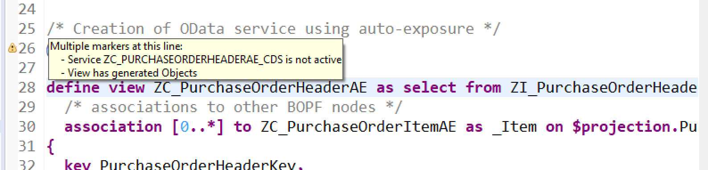

# Exposing the Virtual Data Model with OData

The next step is to generate a OData service on the basis of the virtual data model created in the
previous chapter ([The Virtual Data Model of the Order Monitor](../docs/order_monitor_vdm.md)).

## Prerequisites

This chapter requires a basic knowledge of OData and some of the tools to work with OData. Before
continuing with this chapter it is therefore recommended to first complete the developer mission [Take a Deep Dive into OData](https://developers.sap.com/mission.scp-3-odata.html).

## Exposing CDS Views using OData

There are several options to expose CDS views using OData. In this chapter two approaches are shown:

- Auto-exposure using the `@OData.publish: true` annotation
- Creation of a OData service in the **SAP Gateway Service Builder**

There are different advantages and disadvantages to each of the two approaches. While the auto-exposure using the
`@OData.publish: true` annotation is quick and easy it does not offer any access to the generated runtime artifacts.
Therefore, it there are no options to modify or change the exposed data.

In contrast to that the creation of a OData service using the **SAP Gateway Service Builder** is much more complex. However, as a result data provider classes and model provider classes are generated. This classes can be extended in order to modify
the data returned by the service.

A general recommendation is to use the auto-exposure feature only for very simple scenarios where no modification of the
runtime artifacts is required. In the following section the virtual data model of the Sales Order Monitor is first
exposed using auto-exposure. After that, a OData service is generated using the SAP Gateway Service Builder.

### Auto-Exposure of an OData Service

As a first step the generated consumption view is exposed using auto-exposure. To do soe only the annotation
`@OData.publish: true` needs to be added to the consumption view (cf. the following screenshot).
After saving and activating the view a little warning icon is shown next to the annotation.


The detailed warning message is shown in the following screenshot. The warning message states, that the generated service
is not active. While the required runtime artifacts have been generated, those have not been exposed yet.



Services are exposed using transaction `/IWFND/MAINT_SERVICE`. The start scree first shows all services, that are
already exposed. Service are added using the **Add Service** button.


In the next screen the available service can be filtered by providing the system alias (LOCAL in our example) and the
technical name of the service. Note, that the technical name of the service is the name of the consumption view
followed by the suffix _CDS. As service can be exposed by clicking the **Add Selected Services** button.


After the service is exposed successfully the warning message disappears and only a little icon is visible next to the
`@OData.publish: true` annotation. The tooltip for this icon contains a link to test the generated OData service. Clicking
on this link open the OData service in a browser using a simple debug interface.


### Exercise 1

Expose the sales order data from the consumption view generated in the previous chapter using
the auto exposure feature. Whe asked of a package to be save the generated artifacts use the package you have
been using for the whole exercises.

After the service is exposed use different OData queries to analyse the exposed data.

### Exposing OData using the SAP Gateway Service Builder

The next step is exposing the consumption view using the SAP Gateway Service Builder. The SAP Gateway Service Builder
is available using transaction **SEGW**. The first step is to create a service project. This is done by clicking the new project icon.


On the next screen a project name and a package need to be provided. It is important to start the project name with the customer name
space (e.g. Z or Y) as otherwise the subsequent generation of the service artifacts is going to fail.


In the next step the **Reference Data Soruce** is selected for the project. In this example the data source is the
consumption view for purchase orders created earlier.


Once the data source is selected the exposed entitysets and relations need tio be specified. For the purchase order simply all entity sets and
relations were exposed.


Next, the runtime artifacts need to be generated by clicking the **Generate Runtime Artifacts** icon. In this step also the names of the runtime artifacts
and the service can be specified. For this example simply the proposed names were used.


The result of the generation steps are four new classes in the selected package. In this examples the classes are

| Class Name | Description |
|------------| ----------- |
| ZCL_Z_ERP_IMPL_WS19_DPC | Data provider class. Used by the framework to read the data from the data source. |
| ZCL_Z_ERP_IMPL_WS19_DPC_EXT | Data provider extension class. This class can be used to modify the behaviour of the data provider.|
| ZCL_Z_ERP_IMPL_WS19_MPC | Model provide class. This class generates the metadata of the OData service. |
| ZCL_Z_ERP_IMPL_WS19_MPC_EXT | Model provider extension class. This class can be used to modify the exposed metadata. |

Finally, the service also needs to be exposed. This can either be done using the `/IWFND/MAINT_SERVICE` or using the shortcut from within the
service builder.


### Exercise 2

Expose the sales order data consumption view using the Reference Data Source approach. After the service is exposed:

- Use different OData queries to analyse the exposed data
- Compare the service to the one generated using auto-exposure. What are the differences?

## Adapting the Metadata of the OData Service

The service exposed using the Reference Data Source approach initially does not differ from the service generated using the auto-exposure.
This is not really surprising as in bose cases only the generated artifacts were used. However, using the model provider extension class
it is  possible to easily change the exposed service in the Reference Data Source approach.

For example, the generated names of the entity set and the entity, `ZC_PurchaseOrderHeaderTPType`and `ZC_PurchaseOrderHeaderTP` respectively,
are technical names. They obscure the semantics of the service. Instead of these technical names the term PurchaseOrderHeader for the entity and PurchaseOrderHeaders
for the entity set should be used. This can be achieved by overriding the `define` method of the model provider extension class.

The following listing shows the ABAP code to rename the main entity sets of the generated service.

> **Note:** The reason only the entity sets are renamed and not also the entities is related to how the
> `@UI` annotations are exposed by the SADL framework. If the entities
> are also renamed the annotation `@OData.entitySet.name` is required in the CDS consumption view.
> Further details are described [here](https://answers.sap.com/questions/12922120/cds-annotations-and-reference-data-source-problem.html).

```ABAP
CLASS zcl_z_erp_impl_ws19_mpc_ext DEFINITION
  PUBLIC
  INHERITING FROM zcl_z_erp_impl_ws19_mpc
  CREATE PUBLIC .

  PUBLIC SECTION.
    METHODS define REDEFINITION.
  PROTECTED SECTION.
  PRIVATE SECTION.
ENDCLASS.


CLASS zcl_z_erp_impl_ws19_mpc_ext IMPLEMENTATION.
  METHOD define.

    super->define( ).

    DATA: lo_entity_set  TYPE REF TO /iwbep/if_mgw_odata_entity_set,
          lo_property    TYPE REF TO /iwbep/if_mgw_odata_property.


    lo_entity_set = model->get_entity_set( 'ZC_PurchaseOrderHeaderTP').
    lo_entity_set->set_name( iv_name = 'PurchaseOrderHeaders' ).

    lo_entity_set = model->get_entity_set( 'ZC_PurchaseOrderItemTP').
    lo_entity_set->set_name( iv_name = 'PurchaseOrderItems' ).

  ENDMETHOD.

ENDCLASS.
```

### Exercise 3

Implement the model provider extension class to provide semantic names in the sales order OData service generated in exercise 2.

## Navigation

- Next chapter: [Fiori Elements based Sales Order Monitor](../docs/order_monitor_fe_1.md)
- Previous chapter: [The Virtual Data Model of the Order Monitor](../docs/order_monitor_vdm.md)