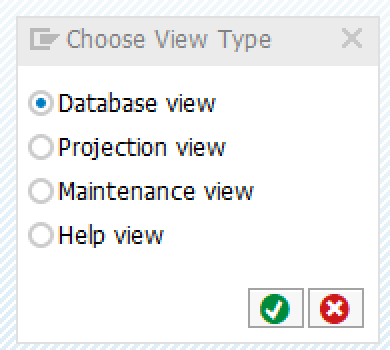

# The virtual data model of the Sales Order Monitor

In this section the virtual data model of the Sales Order Monitor is created. Note, that all the examples
given below are based on the purchase order related database tables in the [EPM](../docs/exploring_epm.md).
However, the Sales Order Monitor needs to access the sales order tables of the EPM. The virtual data model of
the Sales Order Monitor is created as part of the exercises.

## Rules for custom tables

In this tutorial the database tables, that are used as a basis for the virtual data model, are already available in the
system. If custom tables should be used as the basis of a virtual data model these tables need to adhere to the
following rules:

1. The first field needs to be the client
    - Field name: CLIENT
    - Data type: MANDT
1. The second field of the table needs to be the technical primary key
    - Field name: arbitrary
    - Data type: SYSUUID
1. The fields required by the data model
1. Foreign keys for all dependant entities
    - Field name: arbitrary
    - Data type: data type of the primary key field

## Creating the Basis CDS Views

The first step for developing a virtual data model is to create the basic cds views. The basic views are the first
abstraction level above the database tables.

### Creating Database Views

The goal of the virtual data model is to support the Sales Order Monitor.
The Sales Order Monitor should be used to not only display but also to create and change sales orders.
Therefore, transactional functionality is required. To support the transactional functionality a **BOPF**
object is generated by used framework. This generated BOPF object requires that the name of the
field in the CDS view are equal to the names of the field in the underlying persistent table.

One of the goals of the virtual data model is to work with semantic names. The tables in the EPM, however, use abbreviated
names for the fields. Therefore, the first step is to create a database view on top of the database table and rename
the fields in this view. The database view is then used as the basis for the basic CDS view in the next step.

The following steps explain how a database view is created for the table `SNWD_PO`.

1. To create a new database view right click on a package in the project explorer view and select **New -> Other ABAP Repository Object**. This opens a new dialog window. In this window search for **Dictionary View**. Select this entry an click **Next**.
1. Provide a name for the database view (e.g. `ZSNWD_PO`) and click **Finish**. <br>
1. In the next dialog select the entry **Database View**. <br>
1. This opens the SAP GUI window for creating database views. First specify the table that is the basis of the database view (e.g. `SNWD_PO`). <br>
1. Select the tab **View Fields** and click on the button **Table fields**. In the next window select all table fields to add them to the database view. <br>
1. Provide the correct names for all the view fields. Optionally the view fields can also be rearranged or certain fields can be omitted. <br>
1. Select the tab **Maint.Status** and set the allowed access to **read and change**.
1. Finally, save and active the database view.

### Exercise 1

Create database view for the following EPM tables. Make sure to provide good names for all fields of the view.

- `SNWD_SO`
- `SNWD_SO_I`

Use `ZSNWD_SO` and `ZSNWD_SO_I` as names for the database views.

### Creating CDS views

After the creation of the required database views the next step is the creation of the basic CDS views. The
following steps explain how a CDS view is created using ADT. As a basis for the explanation the database view
`ZSNWD_PO` from the previous example is used.

1.  Right click on a package in the project explorer view and select **New -> Other ABAP Repository Object**. This opens a new dialog window. In this window search for **Data Definition**. Select this entry an click **Next**. <br>
1. This opens the dialog box for creating CDS views. Provide a name and a description and click **Next** and **Finish**.
For the example `ZI_PurchaseOrderHeader` is used as the name for the CDS view and `EPM: Purchase Order Header`as the description. Note that the name of the CDS view adheres to the naming conventions described in the introduction to [CDS](../docs/cds_intro.md)
1. This opens a text editor to define the CDS view. The first step is to provide a name for the generated database view. In the example `ZI_POH` is used. Furthermore, the annotation `@VDM.viewType: #BASIC` to classify this CDS view as a basic CDS view needs to be added. Note that the code completion feature of the ADT can be used to add the annotation. <br>
1. Next define from which database table or view the data is selected. In this example the database view `ZSNWD_PO`is used.
1. To add the database fields to the CDS view place the courser between the curly braces and execute the code completion (`<ctrl>+<space>`). Select the template **Insert all elements**. <br>
1. Remove the client field and specify the key fields using the `key`keyword. Provide good names according to the naming conventions for CDS view fields. Additionally provide semantic annotations where required.
1. Beautify the CDS view code using the keyboard shortcut `<shift>+<F1>`.
1. Finally, save and active the CDS view.

The complete source code of the CDS view `ZI_PurchaseOrderHeader` is shown below.

```CDS
@AbapCatalog.sqlViewName: 'ZI_POH'
@AbapCatalog.compiler.compareFilter: true
@AbapCatalog.preserveKey: true
@AccessControl.authorizationCheck: #NOT_REQUIRED
/* Definition of the label of the CDS view */
@EndUserText.label: 'EPM: Purchase Order Header'
/* Definition of the VDM view type */
@VDM.viewType: #BASIC
define view ZI_PurchaseOrderHeader
  as select from zsnwd_po
{
  purchaseorderheaderkey as PurchaseOrderHeaderKEy,
  purchaseorderid        as PurchaseOrderID,
  createdby              as CreatedBy,
  createdat              as CreatedAt,
  changedby              as ChangedBy,
  changedat              as ChangedAt,
  notekey                as NoteKey,
  supplierkey            as SupplyerKEy,
  @Semantics.currencyCode: true
  currencycode           as CurrencyCode,
  @Semantics.amount.currencyCode: 'CurrencyCode'
  grossamount            as GrossAmount,
  @Semantics.amount.currencyCode: 'CurrencyCode'
  netamount              as NetAmount,
  @Semantics.amount.currencyCode: 'CurrencyCode'
  taxamount              as TayAmount,
  lifecyclestatus        as LifeCycleStatus,
  approvalstatus         as ApprovalStatus,
  confirmstatus          as ConfirmStatus,
  orderingstatus         as OrderingStatus,
  invoicingstatus        as InvoiceStatus,
  overallstatus          as OverallStatus
}
```

Note, that the activation of the CDS view generates two DDIC artifacts. The data definition and the corresponding view.
<br>

The following screenshot shows the SQL dependency tree (available via a right click on the data definition and
**Open with -> Dependency Analyser**) of the created view. The dependency tree shows that the data is read from teh database table `SNWD_PO` via the database view `ZSNWD_PO`.
<br>

### Exercise 2

Create the basic CDS views for the following tables and views. Make sure to use the naming conventions described [here](../docs/cds_intro.md). As only the sales order tables are updated using the Sales Order Monitor no database views are
created for the tables `SNWD_PD` and `SNWD_BPA`.

- `ZSNWD_SO`
- `ZSNWD_SO_I`
- `SNWD_PD`
- `SNWD_BPA`

## Creating Transactional CDS Views

The next step in the creation of the virtual data model for the Sales Order Monitor is the creation of interface views.
As the goal is to not only read sales orders using the Sales Order Monitor, but also to create and update them, transaction handling needs to be taken into account.

In the context of the virtual data model this is done using transaction CDS views. The following figure shows the CDS
architecture including the transaction CDS views.


Conceptually, a transactional CDS view is a consumption view. Therefore, it is part of the interface views. In addition
to other consumption transactional CDV views contain certain `@ObjectModel` annotations. The result of these
annotations is that a BOPF object is generated for the transaction CDS views. All changes to the underlying database tables
are preformed via those BOPF objects.

As an example for the creation of transactional CDS views consider the EPM purchase order again. The EPM purchase order data is stored in two
tables, `SNWD_PO` and `SNWD_PO_I`. This storage of the data is related to the [relational model](https://en.wikipedia.org/wiki/Relational_algebra)
and the [normalization](https://en.wikipedia.org/wiki/Database_normalization) of the database tables. However, conceptually there is only the
business object purchase order. A user of an application on top of the EPM does not need to know how the data is organized on inside
the database. Instead a user is only concerned with creating a purchase oder or changing the status of one of its items.

To cope with this common situation the BOPF defines that a **business objects** consists of a hierarchy of nodes. One of these nodes is the
**root node**. The root note the conceptual business object a user is concerned with. In the EPM example the purchase order is the business object.
The root node of the business object is the purchase order header. The root note consists of a optional composition of dependent nodes.
These nodes only exit is also the root node exists. An examples of
such a dependent node are the items of a purchase order. Items of a purchase order only exist if there is a purchase order header.
Furthermore, there can also be association to other business objects. These business objects are independent of the current object but
related. An example of an association is the delivery address of a purchase order. In order to allow the generation of a complete BOPF
business object on the basis of the CDS views the root node and its relation to the dependent nodes as well as its associations need to be specifies
using the `@ObjectModel` annotations. The following tables describes the most important `@ObjectModel` annotations. Further details can be found in the documentation
of the annotations.

| Annotation | Description |
|------------| ----------- |
| `@ObjectModel.transactionalProcessing: true` | Enables the transactional runtime support. It may only be defined on root view level. |
| `@ObjectModel.compositionRoot: true` | Defines the current view as the root node of a composition (BOPF object). |
| `@ObjectModel.association.type` | Defines the association type that is used for defining a compositional view hierarchy. |

To model the transactional CDS view for the EPM purchase order two CDS view are required.
One for the purchase order header and one for the
purchase order items. The source code of the two views is shown below.

The source code of the transactional view for the purchase order header:

```cds
@AbapCatalog.sqlViewName: 'ZI_POH_TP'
@AbapCatalog.compiler.compareFilter: true
@AbapCatalog.preserveKey: true
@AccessControl.authorizationCheck: #NOT_REQUIRED
@EndUserText.label: 'EPM: Purchase Order Header (transactional)'

/* Definition of the VDM view type */
@VDM.viewType: #TRANSACTIONAL

/* BOPF object model */
@ObjectModel: {
    modelCategory: #BUSINESS_OBJECT,
    compositionRoot: true,
    transactionalProcessingEnabled: true,
    writeActivePersistence: 'ZSNWD_PO',
    semanticKey: ['PurchaseOrderID'],
    
    createEnabled: true,
    updateEnabled: true,
    deleteEnabled: true
}
define view ZI_PurchaseOrderHeaderTP 
    as select from ZI_PurchaseOrderHeader 
    /* associations to other BOPF nodes */
    association [0..*] to ZI_PurchaseOrderItemTP as _Item
    on $projection.PurchaseOrderHeaderKey = _Item.PurchaseOrderHeaderKey
{
    key PurchaseOrderHeaderKey,
        PurchaseOrderID,
        SupplyerKey,
        NoteKey,
        CurrencyCode,
        GrossAmount,
        NetAmount,
        TayAmount,
        LifeCycleStatus,
        ApprovalStatus,
        ConfirmStatus,
        OrderingStatus,
        InvoiceStatus,
        OverallStatus,

    /* Definition of composition relation */
    @ObjectModel.association.type: #TO_COMPOSITION_CHILD
    _Item
} 
 ````

The source code of the transactional view for the purchase order items:

```cds
@AbapCatalog.sqlViewName: 'ZI_POI_TP'
@AbapCatalog.compiler.compareFilter: true
@AbapCatalog.preserveKey: true
@AccessControl.authorizationCheck: #NOT_REQUIRED
@EndUserText.label: 'EPM: Purchase Order Item (transactional)'

/* Definition of the VDM view type */
@VDM.viewType: #TRANSACTIONAL

/* BOPF object model */
@ObjectModel: {
    modelCategory: #BUSINESS_OBJECT,
    transactionalProcessingEnabled: true,
    writeActivePersistence: 'ZSNWD_PO',
    semanticKey: ['PurchaseOrderID', 'PurchaseOrderItemPosition'],

    createEnabled: true,
    updateEnabled: true,
    deleteEnabled: true
}
define view ZI_PurchaseOrderItemTP 
    as select from ZI_PurchaseOrderItem 
    /* associations to other BOPF nodes */
    association [1..1] to ZI_PurchaseOrderHeaderTP as _Header
    on $projection.PurchaseOrderHeaderKey = _Header.PurchaseOrderHeaderKey{

    key PurchaseOrderItemKey,
        PurchaseOrderHeaderKey,
        PurchaseOrderItemPosition,
        ProductKey,
        NoteKey,
        CurrencyCode,
        GrossAmount,
        NetAmount,
        TaxAmount,
    
        /* Definition of composition relation */
        @ObjectModel.association.type: [#TO_COMPOSITION_PARENT, #TO_COMPOSITION_ROOT]
        _Header
} 
```

Note, that the two views are dependant on each other, the CDS view `ZI_PurchaseOrderHeaderTP` has an association to the CDS view `ZI_PurchaseOrderItemTP`, and vice versa.
Because og this, the CDS views can not be created and activates in one step. Instead, first the CDS view `ZI_PurchaseOrderHeaderTP` needs to be created **without** the associations. 
After it has been activated, the CDS view `ZI_PurchaseOrderItemTP` can be created and activated. Finally, the association can be added to the CDS view `ZI_PurchaseOrderHeaderTP`.

### Exercise 3

Create the transactional CDS views for two basic views created in exercise 2. The persistent tables for the transactional CDS views are the two
database views `ZSNWD_SO` and `ZSNWD_SO_I`
and views. Make sure to use the naming conventions described [here](../docs/cds_intro.md). As only the sales order tables are updated using the Sales Order Monitor no database views are
created for the tables `SNWD_PD` and `SNWD_BPA`.

### Generated Repository Objects

When the transactional CDS views are activated the first visible change is a little icon that is added to the CDS vie source next to the
`@ObjectModel.transactionalProcessing: true` line.


A click on this icon shows that a business object has been generated in the backend.


A click on the business object link opens the **Business Object Overview** editor. The following screenshot shows the node structure of the generated business object.
As expected, the business objects consists of two nodes, the root node and one child node. Besides the generated structures and table types also
the underlying tables for the persistence are visible. In this example the tables are actually the database views generated earlier. 


The generation of the business object resulted in the generation of a number of repository objects. The following screenshot show the generated objects.
Besides the DDIC objects (structures and tabale types) also a interface (`ZIF_I_PURCHASEORDERHEADERTP_C`) containing important constants is generated.


### Testing the Generated Business Object

In its current state the generated business object can already been used. One way to interact with the business object is the BOPF Test Environment. The
test environment is started by right clicking on the business object and selecting **Run As -> Test Environment.


This opens the transaction shown in the following screen shot. With this test environment data existing purchase orders can be read from the database. Furthermore,
it is also possible to create new entries on the database.


### Exercise 4

Use the BOPF Test Environment to:

- Read an existing sales order from the database
- Navigate to the items of this sales order
- Create a new sales order in the database.

Which data is necessary to create a new sales order? Does the business object behave as expected?


In the next step a simple ABAP report is used to read data using the BOPF framework. the source code below shows a simple 
ABAP program that reads the data of a purchase order using the BOPF object. For this, the generated structures as well
as the generated interface are used.

```ABAP
REPORT z_bopf_api_demo.

PARAMETERS po_id TYPE zi_purchaseorderheadertp-purchaseorderheaderkey.

DATA node_data_tab TYPE ztipurchaseorderheadertp.

DATA(service_manager) = /bobf/cl_tra_serv_mgr_factory=>get_service_manager( zif_i_purchaseorderheadertp_c=>sc_bo_key ).

service_manager->retrieve(
  EXPORTING
    iv_node_key             =  zif_i_purchaseorderheadertp_c=>sc_node-zi_purchaseorderheadertp
    it_key                  = VALUE #( ( key = po_id ) )
  IMPORTING
    et_data                 = node_data_tab
).

READ TABLE node_data_tab INDEX 1 ASSIGNING FIELD-SYMBOL(<node_data>).

WRITE <node_data>-purchaseorderid.
```

### Exercise 5

Write a ABAP report that reads sales order data using the sales order BOPF object generated for the transactional view created in exercise 3.
The input of the report should be the header key of a sales order. The output should be:

- the sales order ID, the gross amount and the currency
- all sales order positions consisting of
  - sales order item position
  - the gross amount of the position
  - the currency of the position.

The generated BOPF object is merely a stub. In the chapter [Extending the Sales Order BOPF object](docs/order_monitor_bopf.md) this stub is extended with further functionality.

## Creating the Consumption CDS views

As mentioned in the chapter [Introduction to CDS](../docs/cds_intro.md) the consumption views
are the interface for different components accessing the interface views, and consequently also
the business object. The consuming components need to know about the transaction properties
of the underlying interface views as well. Therefore, the consumption view repeats most of the
transactional annotations of the underlying interface view. However, instead of the
`@ObjectModel.transactionalProcessing: true` annotation the `@ObjectModel.transactionalProcessingDelegated: true`
annotation is used. If this annotations is present no BOPF object is created. Instead, all transactional
functionality is handled by the underlying interface view and the corresponding BOPF object. 

The source code for the two consumption CDS views `ZC_PurchaseOrderHeaderTP` and `ZC_PurchaseOrderItemTP` is shown below.

```CDS
@AbapCatalog.sqlViewName: 'ZC_POH'
@AbapCatalog.compiler.compareFilter: true
@AbapCatalog.preserveKey: true
@AccessControl.authorizationCheck: #NOT_REQUIRED
@EndUserText.label: 'EPM: Purchase Order Header (transactional)'

/* Definition of the VDM view type */
@VDM.viewType: #CONSUMPTION

/* BOPF object model */
@ObjectModel: {
    modelCategory: #BUSINESS_OBJECT,
    compositionRoot: true,
    
    /* forwarding of the transactional proessing */
    transactionalProcessingDelegated: true,
    
    semanticKey: ['PurchaseOrderID'],
    
    createEnabled: true,
    updateEnabled: true,
    deleteEnabled: true
}

define view ZC_PurchaseOrderHeaderTP 
    as select from ZI_PurchaseOrderHeaderTP
    /* associations to other BOPF nodes */
    association [0..*] to ZC_PurchaseOrderItemTP as _Item
    on $projection.PurchaseOrderHeaderKey = _Item.PurchaseOrderHeaderKey {
    key PurchaseOrderHeaderKey,
        PurchaseOrderID,
        SupplyerKey,
        NoteKey,
        CurrencyCode,
        GrossAmount,
        NetAmount,
        TayAmount,
        LifeCycleStatus,
        ApprovalStatus,
        ConfirmStatus,
        OrderingStatus,
        InvoiceStatus,
        OverallStatus,
        
    /* Definition of composition relation */
    @ObjectModel.association.type: #TO_COMPOSITION_CHILD
    _Item     
} 
```

```CDS
@AbapCatalog.sqlViewName: 'ZC_POI'
@AbapCatalog.compiler.compareFilter: true
@AbapCatalog.preserveKey: true
@AccessControl.authorizationCheck: #NOT_REQUIRED
@EndUserText.label: 'EPM: Purchase Order Item (transactional)'

/* Definition of the VDM view type */
@VDM.viewType: #CONSUMPTION

/* BOPF object model */
@ObjectModel: {
    modelCategory: #BUSINESS_OBJECT,
    
    /* forwarding of the transactional processing */
    transactionalProcessingDelegated: true,
  
    semanticKey: ['PurchaseOrderID', 'PurchaseOrderItemPosition'],

    createEnabled: true,
    updateEnabled: true,
    deleteEnabled: true
}

define view ZC_PurchaseOrderItemTP 
    as select from ZI_PurchaseOrderItemTP 
    /* associations to other BOPF nodes */
    association [1..1] to ZC_PurchaseOrderHeaderTP as _Header
    on $projection.PurchaseOrderHeaderKey = _Header.PurchaseOrderHeaderKey {

    key PurchaseOrderItemKey,
        PurchaseOrderHeaderKey,
        PurchaseOrderItemPosition,
        ProductKey,
        NoteKey,
        CurrencyCode,
        GrossAmount,
        NetAmount,
        TaxAmount,
    
        /* Definition of composition relation */
        @ObjectModel.association.type: [#TO_COMPOSITION_PARENT, #TO_COMPOSITION_ROOT]
        _Header
} 
```

The resulting hierarchy of views is shown in the following screenshot for the
consumption view `ZC_PurchaseOrderHeaderTP`.


### Exercise 6

Create the consumption CDS views for the transactional views created in exercise 3.

With the last exercise the first version of the virtual data model of the Sales Order Monitor is finished.
The next step is to expose the data model using OData. This is the prerequisite to create
an Fiori elements application on top of the virtual data model.

## Navigation

- Next chapter: [Exposing the Virtual Data Model with OData](../docs/order_monitor_odata.md)
- Previous chapter: [Introduction to CDS](../docs/cds_intro.md)
