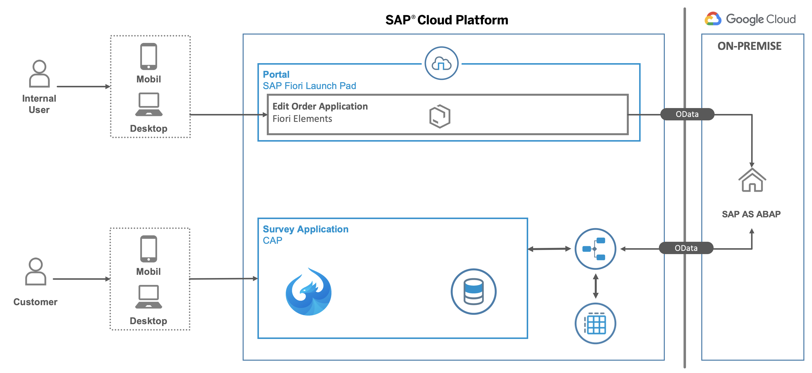

# Scenario overview

The scenario implemented in this tutorial is based
on the SAP NetWeaver Enterprise Procurement Model (EPM). An introduction to the EPM is available [here](https://archive.sap.com/documents/docs/DOC-31458).
The aforementioned document state that
> The NetWeaver Enterprise Procurement Model (EPM) is an application intended to be used for
> demonstration and testing purposes. While the scope of EPM is complex enough to be used as basis for
> testing and demonstration of NetWeaver technologies it is not a full-fledged application for a productive
> system environment.

The EPM is based on a fictitious retail company called ITelO, that

> buys and sells computers & accessories....
> ... Customers can purchase goods either directly from ITelO or indirectly from a supplier if the goods are not on stock. In order to support a
> realistic scenario, there are means to generate mass data which allow the simulation of real-world data
> volumes for business entities such as purchase orders and master data such as products.
In order to support the describes use cases the EPM contains business objects like products, customers, purchase orders and sales orders. In this tutorial the EPM
model is extended in two directions:

1. A Fiori Elements application named *Sales Order Monitor (SOM)* to view and create sales orders is developed using the [ABAP Programming Model for Fiori](https://help.sap.com/doc/saphelp_nw751abap/7.51.0/en-US/3b/77569ca8ee4226bdab4fcebd6f6ea6/frameset.htm).
1. A survey application named *Red Qaultrics Killer (RQK)*  is implemented using the [SAP Cloud Application Programming Model](https://cap.cloud.sap/docs/). This survey application allows customers to rate their experience related to the ordering process with ITelO.

The following figure gives am overview of the components involved in the implemented scenario.

## Sales Order Monitor (SOM)

## Red Qaultrics Killer (RQK)

## Navigation

- Next chapter: [Exploring the EPM](../docs/exploring_epm.md)
- Previous chapter: [Index](../README.md)