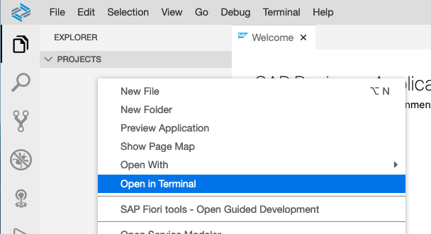
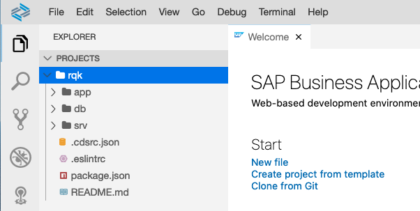
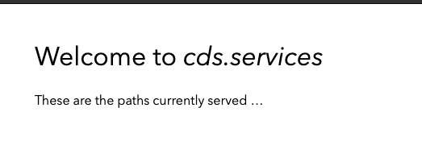
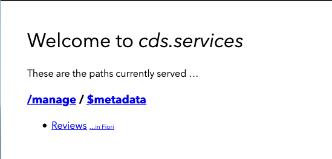
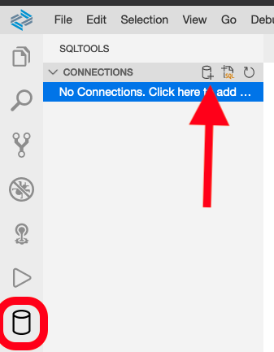
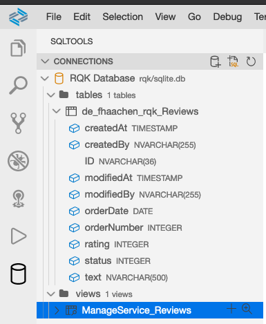
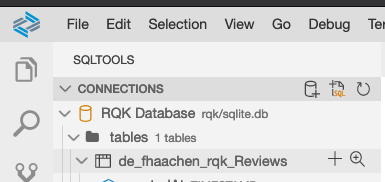

# A SAP CAP Based Survey Application

The first step to develop the RQK application is the implementation of the
survey application for the end users. The applications is developed using the Javascript version of the
[SAP Cloud Application Programming Model (CAP)](https://cap.cloud.sap/docs/).

The development of the RQK application consists of the following steps:

* Initializing the CAP project
* Developing the database model
* Developing services based on the database model
* Developing the UI

## Prerequisites

Different development environments (cf. <https://cap.cloud.sap/docs/get-started/tools>) can be used to develop
applications in the SAP Cloud Application Programming Model. In this tutorial the SAP Business Application Studio
is used. Therefore, a new dev space for the SAP Business Application Studio needs to be created.
The new dev space should be of type **SAP Cloud Business Application**. In addition to the standard extensions
also the **Workflow Management** extension needs to be activated for this dev space.

Note that in the SAP Cloud Platform trail account there is a limitation regarding the dev spaces:
> You are allowed a maximum number of 2 dev spaces, and only 1 can be run at a time.

## Initializing the CAP project

Although the SAP Business Application Studio is used as a development environment, the
[CDS command line tools](https://cap.cloud.sap/docs/get-started/) are used to
initialize the CAP project. While the SAP Business Application Studio also provides
GUI based generators using the CDS command line tools is the most common approach. Being
used to the CDS command line tools also simplifies switching to different development environments later.

In order to use the CDS command line tools a terminal window is necessary. To open a new terminal window
in the SAP Business Application Studio right click on the empty projects pane and select
**Open in Terminal**.



This opens a new terminal window in the projects folder of the current dev space. In order to initialize a 
CAP project execute the following command in the terminal:

```bash
cds
```

This command prints out some general information regarding the CDS command line tools. Most importantly,
an overview of the available commands is given. Next execute 

```bash
cds help init
```

to get a list of the different available options for the ```cds init``` command. To initialize the
RQK application execute the following command.

```bash
cds i rqk
```

The result is an empty CAP project is generated inside the ```rqk``` folder. The empty projects consists of:

* the (empty) ```app```, ```db``` and ```srv``` folder
* the ```package.json``` file
* the ```README.MD``` file



To finish the initial setup of the project the required node.js modules need to be installed.
To install the required modules execute ```npm install``` in the project directory. Note, that
it is necessary that current directory of the terminal is the root folder of the
RQK project. This can be achieved by either navigating to the folder (e.g. using ```cd rqk```)
or by right clicking on the folder an opening a new terminal window there.

## Developing the database model

After the empty project has been created the next step is to define the data model. In CAP data models are
defined using [Core Data Services (CDS)](https://cap.cloud.sap/docs/cds/). Note, that the CAP variant of CDS is
similar to the ABAP variant of CDS. However, certain differences regarding the available features
and the syntax exist. The documentation of the CAP CDS variant is available
[here](https://cap.cloud.sap/docs/cds/).

In order to generate the data model for the RQK application create a file with the name ```schema.cds``` in the
```db```folder of the project. Add the following CDS code to the ```schema.cds``` file.

```javascript
using { cuid, managed } from '@sap/cds/common';

namespace de.fhaachen.rqk;

entity Reviews : cuid, managed {
  rating : Integer;
  text   : String(500);
  status : Integer enum {
              initial = 0;
              submitted = 1;
              completed = 2;
           };
  orderNumber : Integer;
  orderDate : Date;
}
```

The CDS code above defines one entity named ```Review```. This entity consisting of the following elements:

* the ```cuid``` aspect (cf. <https://cap.cloud.sap/docs/cds/common#aspect-cuid>)
* the ```managed``` aspect (cf. <https://cap.cloud.sap/docs/cds/common#aspect-managed>)
* a ```rating``` of type ```Integer```
* a ```text``` of type ```String``` and a maximum length of 500 chars
* a ```status``` of type ```Integer``` and a possible list of values defined as an enumeration
(cf. <https://cap.cloud.sap/docs/cds/cdl#enums>)
* a ```orderNumber``` of type ```Integer```
* a ```orderDate``` of type ```Date```

It is important to understand, that the CDS is a declarative description of a data model. Using the cds command line
tools of CAP this declarative description can be compiled into different data models.
As an example the ```schema.cds```` file now compiled into SQL. Using the command line tools this compilation can be
performed using the following command:

```bash
cds c db/schema.cds -2 sql
```

The result of the execution is shown below.

```sql
CREATE TABLE de_fhaachen_rqk_Reviews (
  ID NVARCHAR(36) NOT NULL,
  createdAt TIMESTAMP,
  createdBy NVARCHAR(255),
  modifiedAt TIMESTAMP,
  modifiedBy NVARCHAR(255),
  rating INTEGER,
  text NVARCHAR(500),
  status INTEGER,
  orderNumber INTEGER,
  orderDate DATE,
  PRIMARY KEY(ID)
);
```

By using the ```cuid``` aspect a primary key named ```ID``` of type ```NVARCHAR(36)``` is created.
Furthermore, the  ```managed``` aspect results in the four columns ```createdAt```,
```createdby```,```changedAt``` and ```createdBy```. Finally also the columns for the
other attributes like rating and status are created.

Note, that the enum values are not represent in the resulting SQL. Consequently, the possible values will
not be enforced on the database level.

### Sample data in SQLite

The next step is to bring the data model that has been defined in the ```schema.cds``` file to life.
In order to do this some sample data is needed. To add sample data to the application two steps
are necessary:

* add a folder ```data``` to the ```db``` folder
* add a file named ```de.fhaachen.rqk-Reviews.cds``` to this folder
* add the following lines to this CSV file

```CSV
ID, orderNumber, orderDate, rating, text, status
66465728-7a9e-4231-9e57-74f878f8b877,00000001,2020-01-01,0, ,0
278acf9a-a7ca-42d7-8033-ba33193133ed,00000002,2020-01-01,0, ,0
428bd000-a76d-4c23-9707-c5d65fc3bc56,00000042,2020-01-01,6,War alles ganz OK, 1
c612b7c3-6cca-47ba-be5e-227e2a88324c,12345000,2020-01-01,9, Super, 2
```

The CSV file defines four Review entities together with some sample data. The naming convention
used for the sample data files is the namespace of the entity followed by a dash and the entity name
(```<namespace>-<entity name>.csv```).

The next step is to deploy the defined data model into an SQLite in memory data base. This is achieved
by executing

```bash
cds watch
```

in the terminal. The ```cds watch``` command starts a web server in order to enable testing of the
application without the need to deploy to the SAP Cloud Platform first. Once the web server
hast stared a pop up opens. By clicking on the **Open in New Tab** link a web site opens that shows all
available service.



Currently no services are available in the project. To add a first to the project create a file
named ```manage-service.cds``` to the ```srv``` folder. Add the following content to this file:

```JSON
using { de.fhaachen.rqk as rqk } from '../db/schema';
service ManageService { 
  entity Reviews as projection on rqk.Reviews;
}
```

This CDS defines a new service named **ManageService** that exposes the Review entity fo the data model.
Once the file is saved ```cds watch``` notices the change and compiles the ne file. As a result
the terminal should contain log messages similar to the one below.

```Shell
[cds] - using bindings from: { registry: '~/.cds-services.json' }
[cds] - connect to db > sqlite { database: ':memory:' }
/> successfully deployed to sqlite in-memory db

[cds] - connect to messaging > local-messaging {}
[cds] - serving ManageService { at: '/manage' }

[cds] - launched in: 1000.760ms
[cds] - server listening on { url: 'http://localhost:4004' }
```

These log messages contain the following information:

1. An SQLite in memory database is used (```deployed to sqlite in-memory```)
1. The ManageService is available at /manage (```[cds] - serving ManageService { at: '/manage' }```)

Reloading the **Welcome to cds.service*** web site should now show the review entity.

.

Clicking on the link **Review** serves the sample data from the CSV file using OData v4.
By only defining a data model and a service CAP already provides the full OData v4 functionality.

### Exercise 1

Try different OData features with the service. It is possible to change Reviews or to create new Reviews?
If yes, how? What happens when the ```cds watch``` command is restarted to the data?

If you need a reminder on the different OData features visit
[Take a Deep Dive into OData](https://developers.sap.com/mission.scp-3-odata.html) again. Note, if
you try to access the service using e.g. Postman you need to copy the header cookies from the request in the
browser.

## Persisting Data in a Database

One of the limitations you might have notices in the previous exercise is, that changes to the data are
lost when the preview of the application restarts (i.e. ```cds watch``` restarts the application). The reason is
that the application is currently running using an in-memory database.

The next step is to add a persistent database to our application. The SAP Cloud Platform in conjunction
with the CAP currently offers [two database variants](https://cap.cloud.sap/docs/guides/databases),
SAP HANA and SQLite. SQLite is the database used for local development and testing, SAP HANA the
database for deploying the application.

Adding SQLite support to the project is quite simple. It only requires executing the following command:

```Shell
cds deploy --to sqlite
```

According to the [CAP documentation](https://cap.cloud.sap/docs/guides/databases) this
command performs the following steps

> 1. Creates an SQLite database file in your project.
> 1. Drops existing tables and views, and re-creates them according the CDS model.
> 1. Deploys CSV files with initial data.


### Exercise 2

Execute the ```cds deploy --to sqlite``` in your project. Restart the preview of the application
and try adding reviews using the service. What happens to the data now when the application restarts?

The result of running the ```cds deploy --to sqlite``` can bee seen in several areas of the project.

1. A file named ```sqlite.db``` is created in the base directory of the project.
1. The requirement of the SQLite database is added to the ```package.json``` file.

The next step is to analyse the created database. To do this open the SQL tools and add a new connection.

.

Select SQlite as the connection type. In the following dialog provide a name for the connection and the path
to the ```sqlite.db``` file. If your project folder is named ```rqk``` the path to the file is
```rqk/sqlite.db```. Finish the creation of the connection and connect to the database.

Once the connection of to the database is established the created database artifacts can be viewed.
Note, that as a result of the deployment of the CDS file a database table and a database view have been
created.
.

### Exercise 3

Use the Database Tools Data Preview to make sure the records created in the previous exercise have
indeed been added to the database.
.

### Enabling deployment to SAP HANA database

Execute the ```cds deploy --to sqlite``` also added
the following requirement to the ```cds``` section of the ```package.json``` file.

```json
"cds": {
        "requires": {
            "db": {
                "kind": "sqlite"
            }
        }
    }
```

In order to being able to deploy to a SAP HANA database later this section needs to be changed to

```json
"cds": {
        "hana": {
            "deploy-format": "hdbtable"
        },
        "requires": {
            "db": {
                "kind": "sql"
            }
        }
    }
```

According to the [CAP documentation](https://cap.cloud.sap/docs/guides/databases) this configuration
has the following effect:
> ```kind:sql``` declares the requirement for an SQL database. It evaluates to sqlite in the development profile
> (active by default), while in production it equals hana. This way you don’t need to modify this file if you
> want to switch between the two databases. Use the --production parameter in commands like cds build to enforce
> the production profile.

## Extending the OData Services


## Developing the UI

* create admin list report
* https://blog.ui5cn.com/6-creating-custom-ui5-app-in-sap-capm-7-steps-to-get-started-with-sap-capm/
* https://www.youtube.com/watch?v=es0eAtAQPzk

## Navigation

* Next chapter: [RQK Workflow](../docs/rqk_workflow.md)
* Previous chapter: [RQK Overview](../docs/rqk_overview.md)